# AI for Medicine

[toc]


## AI for Medical Diagnosis

medical diagnostic task 医疗诊断案例

edema  [ɪˈdiːmə] 水肿

fluid 积液

radiology 放射医疗

pneumonia [njuːˈməʊniə] 肺炎

dermatology [ˌdɜːməˈtɒlədʒi] 皮肤病学

dermatologist 皮肤病学家

determine whether a **mole** is a skin cancer or not 色素痣

ophthalmology [ˌɒfθælˈmɒlədʒi] 眼科学

retinal fundus photos 视网膜眼底图片

diabetic retinopathy 糖尿病型视网膜突变 


histopathology [ˌhɪstəʊpəˈθɒlədʒi] 组织病理学

pathologist 病理学家

lymph node 淋巴结


patch 色斑，小块

病理学图片都很大，因此每次都选出不同的patch进行训练


brain tumor segmentation 脑肿瘤分割

Chest X-Ray 可以检测many diseases，比如pneumonia, lung cancer, ，每年会新增2 billion图片。

分为Mass和Normal两种。pulmonary mass肺结节（肿块）

skin lesion [ˈliːʒn]  皮肤病变

diameter  [daɪˈæmɪtə(r)] 直径

Mass的定义：damage of tissue seen on a chest X-ray as greater than 3 centimeters in diameter


### 医疗领域的三大难题 3 Key Challenges

Class Imbalance; Multi-Task; Dataset Size

#### Class Imbalance

##### Binary Cross-entropy Loss

$$
\begin{aligned}

&{L(X, y})=\left\{\begin{array}{ll}
-\log P(Y=1 \mid X) & \text { if } y=1 \\
-\log P(Y=0 \mid X) & \text { if } y=0
\end{array}\right.
\end{aligned}
$$
对于损失函数来说，只要控制大部分y=0就可以让损失降到最小，因此改进损失函数。通常$w_{p}$分母都是总数，分子取对方的数量来做平衡。用分数形式的好处是：Loss可以和之前没有加权重时可以比较。


$$
L(X, y)=\left\{\begin{array}{ll}
w_{p} \times-\log P(Y=1 \mid X) & \text { if } y=1 \\
w_{n} \times-\log P(Y=0 \mid X) & \text { if } y=0
\end{array}\right.
$$

##### Resampling

上采样和下采样

#### Multi-Task

可以有三个模型分别解决三个问题，但是用一个模型更加好，而且可以拥有共享的特征。

Mass vs No Mass

Pneumonia vs No Pneumonia

Edema vs No Edema

##### Multi-label / Multi-task Loss

$$
L\left(X, y_{\text {mass }}\right)+L\left(X, y_{\text {pneumonia }}\right)+L\left(X, y_{\text {edema }}\right)
$$


结合样本数量的平衡，我们可以给出对于分辨Mass任务的损失函数：
$$
\begin{array}{c}
\text { Multi-Task } \quad L\left(X, y_{\text {mass }}\right)+L\left(X, y_{\text {pneumonia }}\right)+L\left(X, y_{\text {edema }}\right) \\
L\left(X, y_{\text {mass }}\right)=\left\{\begin{array}{ll}
-w_{\mathrm{p}, \text { mass }} \log P(Y=1 \mid X) & \text { if } y=1 \\
-w_{\mathrm{n}, \text { mass }} \log P(Y=0 \mid X) & \text { if } y=0
\end{array}\right.
\end{array}
$$

#### Dataset Size

需要从大样本中学习，模型很大

##### ransfer Learning迁移学习

可以先从其他图像中预训练，前面的layer都是学习边缘特征。然后，固定前面的Layer，只对后面的Layer进行训练。

##### Data Augmentation数据增强

增强点：

不同的图片对比度/明暗程度不一样；

心脏一般在左边，但是不能进行图片的翻转，否则心脏就在右边dextrocadia了

对于Skin Cancer：Rotate+flip

对于组织病理学Histopathology：图片中有不同的阴影shade：可以通过Rotate+Crop+Color Noise制造不同的shade来帮助泛化。


### 样本选取和训练集划分三大难题

#### Patient Overlap

- 要保持训练集和测试集独立。如果有一个带着项链的人的X-Ray一个在训练集一个在测试集，那么模型肯定会记住这个人的标签

反思：在第四范式的实际的项目中，当划分训练和验证样本时：是把份拆开按页划分的，而且同一种类别的样式也没有分开，因此不能保证训练集和验证集独立。

#### Set Sampling

- 小样本且样本不平衡时，要保证测试集中也要有正样本，一般可以设置一个至少 X%，或者在验证集中直接选取50%的正负样本
- 因此采样的顺序应当是：先Test Set再Validation Set最后才是Train Set

#### Ground Truth

inter-observer disagreement 各个专家意见不一：类似我们和业务认为的标注标准不一致。

- Consensus Voting

- 借助外力，比如说Mass的Chest X-ray还可以用CT打标签，比如皮肤病学Dermatology里，标签是由皮肤病变活组织检查skin lesion biopsy决定的


### 评价指标

### Sensitivity Specificity


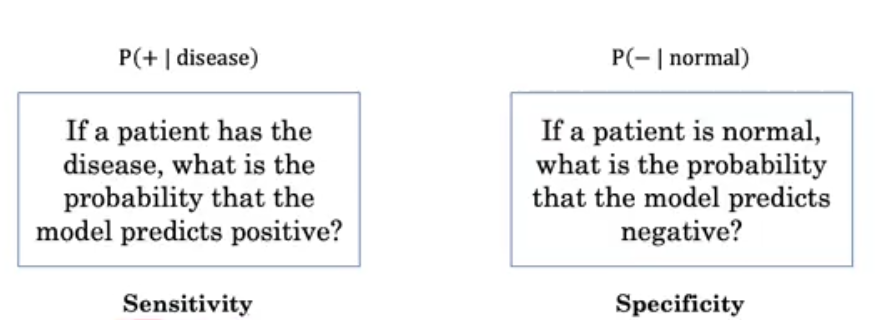


#### PPV NPV

以上的条件概率都是基于已知真实label，来推算预测结果为真的情况。此时如果知道预测结果，想看真是结果时：

PPV=Positive Predictive Value=P(disease|+)

NPV=Negative Predictive Value=P(normal|-)

其实PPV就是Precision，Sensitivity就是Recall

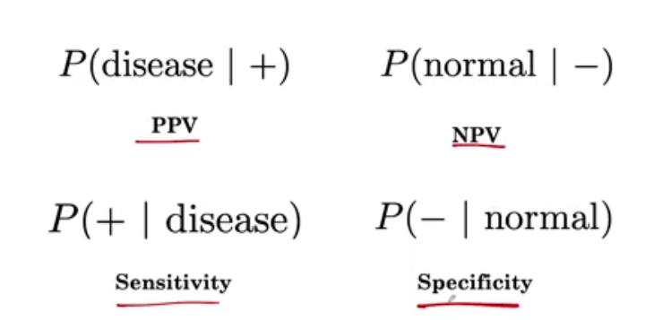

#### Confusion Matrix, ROC Curve, AUC


如果我把Threshold设为0，那么所有的样本都会被预测成+，Sensitivity会变成1，Specificity会变成0

如果我把Threshold设为1，那么所有的样本都会被预测成-，Sensitivity会变成0，Specificity会变成1

- 果然和马凯说的一样，在画ROC曲线前，先把所有的概率值从小到大排列，并带着他们的Label（红：+，蓝色：-）

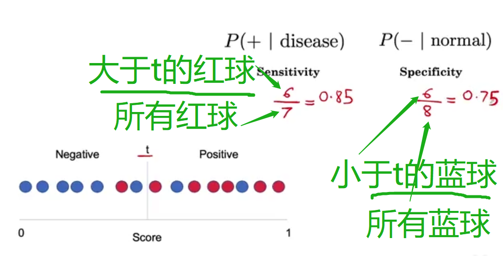

### 置信区间

误解：95%置信区间跟可能性没有关系！There is a nuanced difference细微的差别：


置信区间是你每一次抽样得到的区间，因此再做一次抽样会得到不同的置信区间

如下图：这是6次抽样带来的置信区间。因此，真正的解释是：95%的抽样里的置信区间会包含真实的总体值：p


### 概率校准 Calibration

https://zhuanlan.zhihu.com/p/90479183

校准是你预测有多少人的比例处于某个区间内(x)，相对于实际有多少人处于某个区间内(y)
这个问题在风控和ctr领域比较常见，风控对模型预测的真实概率是比较看重的。例如：

一些银行或者P2P公司会建立机器学习模型来估计拒绝借贷的概率，通过设置阈值以自动过滤一批借贷请求。假设我们对10000个预测概率为0.2左右的用户进行放款，我们通过预测概率为0.2认为这10000个用户中将来有8000个左右能够按时还款付息，而剩下的2000个可能违约赖账成为死账户，这个时候金融机构，尤其是银行，就要根据这种情况进行一些坏账准备，同时根据用户被预测出来的概率，金融机构还会对不同概率区间的用户设置不同的利率，利率的计算建立在用户的预测概率上。但是如果模型根本没法反应真实的概率，这些决策都会受到很大的影响，所以我们需要进行概率校准以使得模型的预测概率和真实概率对应起来

from sklearn.calibration import calibration_curve

### Shap包  模型可解释性

https://github.com/slundberg/shap

### MRI data

核磁共振

特点：多个连续的3D图像

处理方法：随机选取N（这里是3）个截面，就像是图片的3个channel一样进行输入，并把三个图片合成一张。

困难：这N张图不一定是正好对齐的Not Aligned，比如说有旋转，那么这些图片对应的位置会对不上

解决方法：[图像配准](https://www.cnblogs.com/carsonzhu/p/11188574.html)，通过[Image Registration](https://www.sicara.ai/blog/2019-07-16-image-registration-deep-learning)把图片摆正


### Segmentation

2D的像素：pixel 

3D的像素：voxel

cortex information：大脑皮层信息

silver lining：困境中的一线希望

#### 2D方法

一张一张图片预测，然后再回到3D的分割块。但有可能失去3D信息 3D context。比如一个肿瘤在一张图片里，那么很可能旁边的图片里也有。但由于一张一张图片传，很可能学不到这个信息。

#### 3D方法

由于一次性放入3D太占内存，因此把3D图片切成小块，最后再拼起来。但也有可能丢失Spatial Context。

#### U-Net

包括Contracting（收缩） path和Expanding Path

只能用2D的方法训练

3D U-Net 所有操作都变成三维

#### Segmentation

把一张图像分成很多个小块进行预测，然后输出每个正方形小块的概率值。

#### Soft Dice Loss

还记得深度学习的课上，吴老师详细讲了U-Net，但是没有讲损失函数，这里反而讲了它的损失函数

减少Loss等于增加Overlap

p对应预测概率，g对应真实值

Loss越小，希望分子越大分母越小。因此可以突出g=1的情况，不会受到样本不平衡的影响。

如果p在g=0的地方都是1，虽然分子没有优化（都是0），但是分母会压缩，因此也会照顾到为0样本。

**引申**：[Dice Loss](https://zhuanlan.zhihu.com/p/86704421)即取绝对值的版本

[图像语义分割中的 loss function](https://zhuanlan.zhihu.com/p/101773544) cross entropy loss; weighted loss; focal loss; dice soft loss; soft iou loss

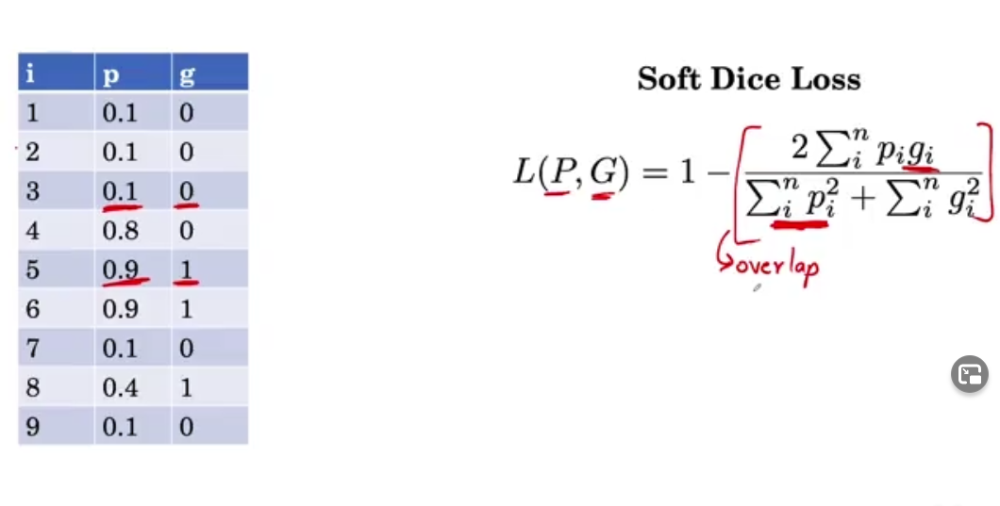

#### 局限性

TB test: tuberculosis 肺结核

retrospective data 历史数据

clinician 临床医师

- 标准不同：清晰度不一样


- 解决方法：可以用旧模型在新数据上，取一小部分用于调参

- 真实世界里还需要进行预处理，clean数据集。
- 训练数据都是Frontal X-ray，真实应用也有可能是侧面Lateral X-ray
- 真实世界要考虑Age, Sex, Socioeconomic Status
- clinician需要可解释性

## AI for Medical Prognosis

(对病情的)预断，预后; 预测; 预言; 展望;

Machine learning is a powerful tool for prognosis, and can provide a tremendous boost to this branch of medicine by using many different types of medical data to make accurate predictions about a patient's future health.

multiple examples of prognostic tasks, including a few examples where prognosis using risk calculations is part of **routine clinical practice**. 常规临床做法

mortality 死亡率

**Without further ado,** let's dive in. 毫不迟延; 干脆; 立即

there are blood tests that are used to estimate the risk of developing breast and **ovarian cancer**. 乳腺癌、卵巢癌

An example of this is **cancer staging**, which gives an estimate of the survival time for patients with that particular cancer. 癌症分期（晚期）

Another example is the six-month mortality risk. This is used for patients with terminal conditions that have become advanced and **uncurable** and is used to determine who should receive **end-of-life care**. 不能治愈的 临终关怀

estimating the 10-year **cardiovascular** risk of an individual. 心血管的;

Profile might also include physical exam findings such as **vital signs** including temperature and blood pressure. 生命体征

Atrial fibrillation 心房颤动（简称房颤）

Atrial fibrillation is a common abnormal **heart rhythm** that puts the patient at a risk of stroke. 心率 

A 70-year-old male diagnosed with Atrial fibrillation has **hypertension** and diabetes. 高血压

congestive heart failure CHF 充血性心脏衰竭; 心力衰竭; 

Liver Disease Mortality 肝病死亡率

This is the **model for end-stage liver disease** which produces what is called the MELD Score。肝病终期

**take the natural log** of the values before **plugging** them **into** the model. 

Now this makes sense because HDL-C is high-density **lipoprotein cholesterol** and that's often called good cholesterol. And thus we might expect would lower the risk of heart disease.脂蛋白 胆固醇

The apple in my left hand already looks **stale** and will expire in two days, 不新鲜的

#### *concordant* pairs

同序对（*concordant* pairs）和异序对（*discordant* pairs）

如果分类变量与数值预测结果方向相同，就叫concordant。如果数值预测两者一样，就叫risk tie

要形成permissible pair，就需要两个gt不同的人，也就是一定要一个死一个没死。


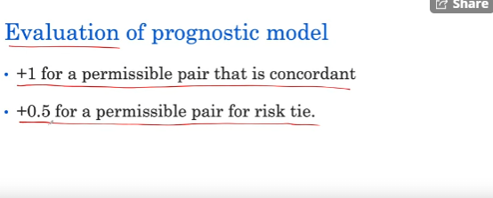

#### C-Index

注意：C-index和acc并没有直接的关系！

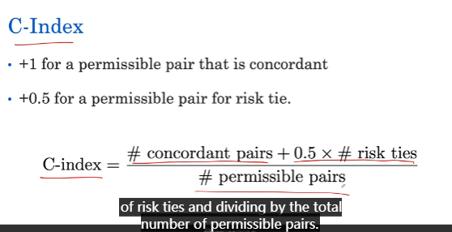


#### 用正态拟合数据

```python
from scipy.stats import norm
data = np.random.normal(50,12, 5000)
fitting_params = norm.fit(data)
norm_dist_fitted = norm(*fitting_params)
t = np.linspace(0,100, 100)
plt.hist(data, bins=60, density=True)
plt.plot(t, norm_dist_fitted.pdf(t))
plt.title('Example of Normally Distributed Data')
plt.show()
```


 *Diabetic Retinopathy* 糖尿病视网膜病变 

Often machine learning models are considered black boxes due to their complex inner workings, but in medicine, the ability to explain and interpret a model may be critical for human acceptance and trust. 


Systolic Blood Pressure 收缩压


We can see that there is a **spike** on the older people between 65 and 75. 尖刺

缺失值的启示：删除缺失值有可能会让模型的训练数据的分布变化，从而导致效果不一致。由上图，old test里年轻人很少，很可能是医生不记录年轻人的血压，但他死了。由于空，我们删了这条数据，最终导致上线效果不一致。

imputation, **impute** the missing value 估算    注意：插值是interpolation

### mean imputation 和 regression imputation

我以为是在不同的类别内，分别对0和1的数据进行回归/取平均，然后预测出缺失值。其实不然，它是一视同仁，直接对所有数据进行回归/取平均。测试集也用训练集的数据


Cardiovascular disease event prediction / CVD prediction 心血管疾病

systolic blood pressure心脏收缩压

无论如何都要填充空值，即使空值不准的目的是：空值可能是数据在某些特定原因下形成的，为了保持数据原有的分布，所以要填充空值。

### 生存模型


censoring 统计学借以描述对某些个体不可能观察到特定点事件发生的现象。在本例中，被观察者在14个月后中途退出了，就写成14+，代表censoring

开始时间是做手术的时间，只要是没有发病，或者退出实验，都会写出xx+


Right censoring：在last contact后总会发生，而不是一直都不会发生。right就是在右边的意思


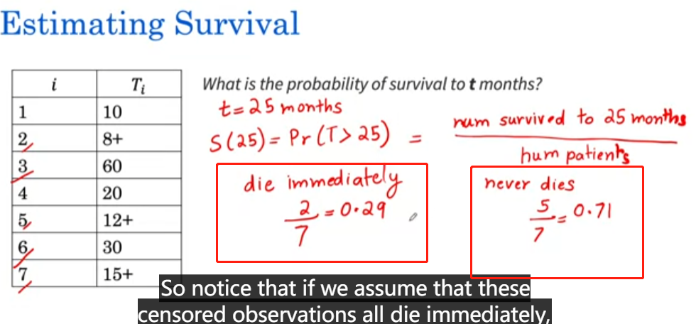

die immediately：实际是每个人立刻死，这时候的存活率，就是存活到这个时间点的人数

Never die相比于die immediately的差别是：分子加上了censoring的部分


Kaplan Meier 估计 /maier/

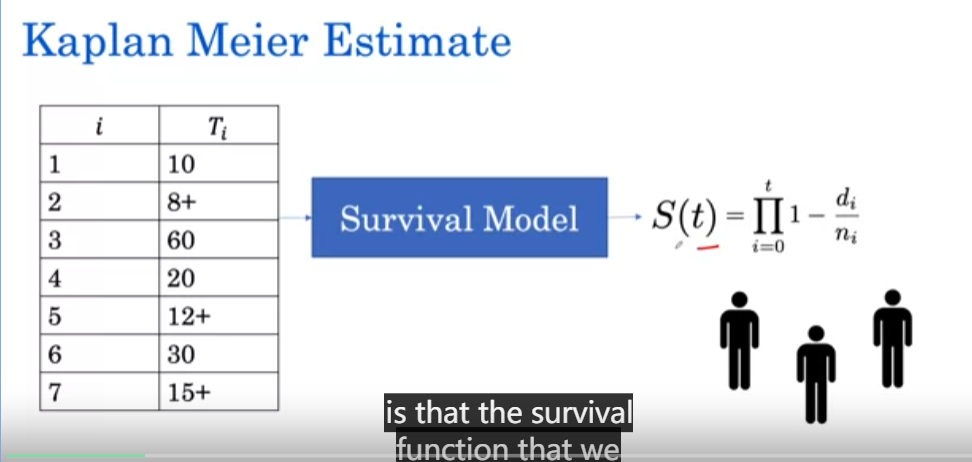


学会了如何推导：S(t)=1-F(T)，F(T)就是T的累计密度函数。

λ(t)

=P(T=t)/P(T>=t)  根据条件概率展开

=f(T)/S(T)  课件中S(t)的形式应当写成>=的，不过在连续的情况下其实都一样

=-S'(t)/S(T)  然后再回到exp的形式


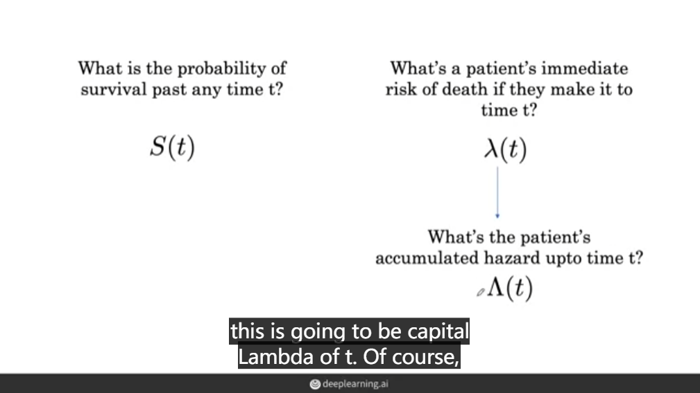


**个人总结**：survival是在起始点看，将来每个时间点还能活下多少人。hazard是将来到了哪个时间点，在那个时间点上你死掉的概率。cumulative hazard是hazard的积分


用exp是保证它乘的系数大于0.在这个例子中，价格is_smoker和age都取0，那么exp(0)=1，就相当于不变。用exp还有一个好处，做系数解释比较不同X的效果时，直接是exp(coef*ΔX)

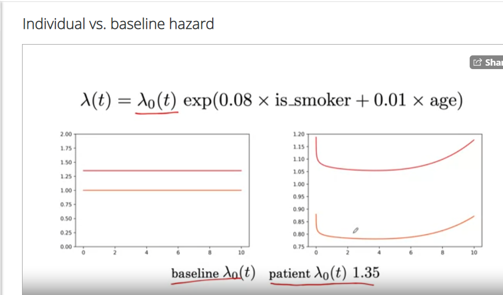


这就是Cox proportional hazard model

chemotherapy [ˌkiːmoʊ]化疗

Nelson Aalen estimator


之前的Caplan Meire是估计Survival S的，这里的Nelson Aalen是估计cumulative Hazard的

之前是连乘，这里是连加


死亡率得分 mortality score

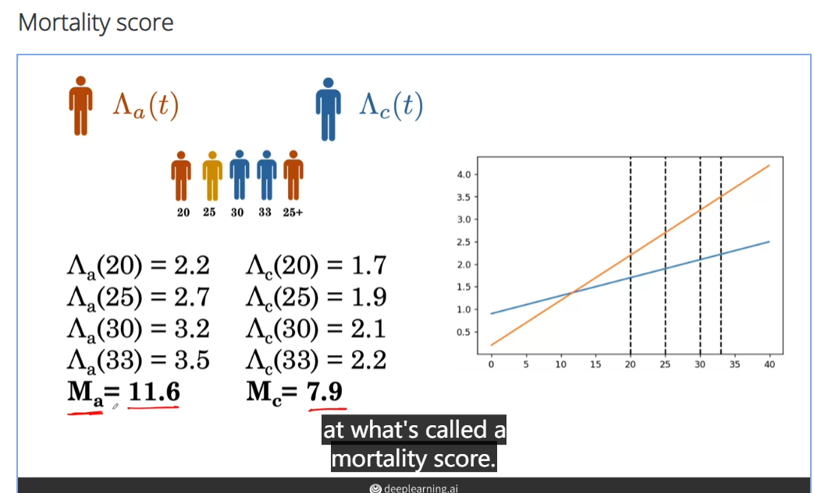

Harrell's C-index

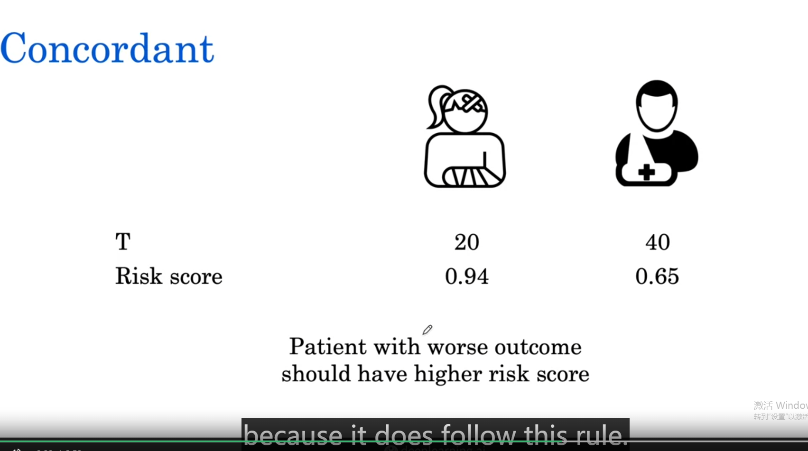

感觉这里的逻辑有点奇怪：他说，正因为这个人只活了20个月，那么他更加惨，那么他的risk score更高。可是我记得之前算hazard时，是有一个先降后升的过程

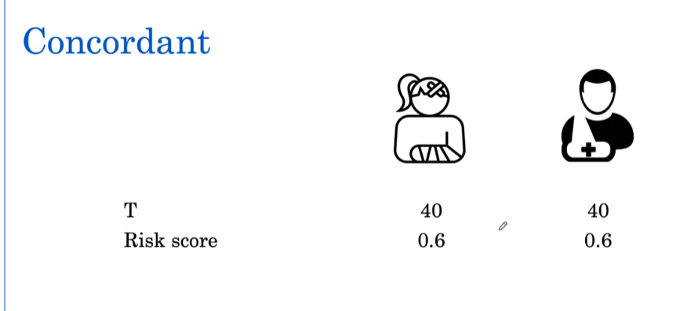

这种也算concordant


这两种都算risk tie，无论是T相同还是risk score相同。这是因为他们之间不完全错，所以都叫risk tie

以前的permissible pair是一定要一个人死一个人没死，现在的即使两个人T相同也可以


B outlived A B比A活得长


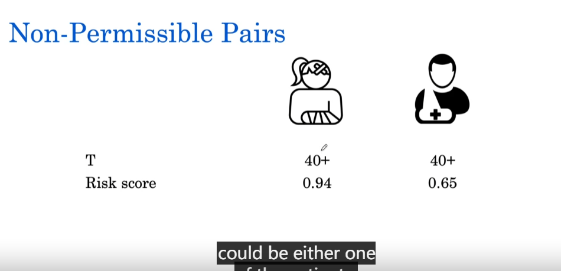

只有这两种是non-permissible


这里面的risk score既可以来源于mortality score，也可以来源于Cox proportional hazard model

## AI for Medical Treatment