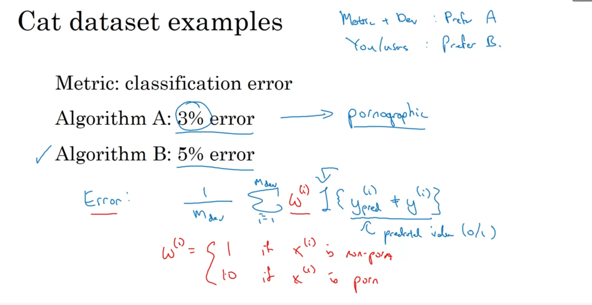

# Deep Learning Specialization 

## Structuring Machine Learning Projects

F1 is the harmonic mean of p and r. 调和平均数

millisecond 毫秒 mɪlisekənd

wake words、trigger words唤醒词，比如siri

optimizing metric & statisfying metric 的经验：只设置一个优化目的，其他限制条件满足就行

dev set验证集

hit the bull's eye 击中靶心

But sometimes **partway** through a project 中途

pornographic 下流的

Indicator Function指示函数 

- 训练集可以和验证测试不一样的分布（反正无脑加样本就行），但是验证集和测试集必须同分布以保证效果的一致性。（我感觉现实中往往达不到）

- 不同的场景中需要定义不同的评估指标：比如说对pornographic很厌恶，那么需要将这些样本加重惩罚

images are blurrier  模糊 blɜːri

images not well framed 没有好好拍照的

- 如果训练验证集和评价指标表现很好，但是测试集不行，需要更换指标或者更换验证集
- 吴老师的经验：尽快先选定指标和训练验证集开始工作。如果之后发现有偏差，再换。这样效率更高

**have a well-defined target and iterate efficiently towards improving performance**

- Bayes optimal error 理论最优准确率 （永远达不到），一群专家的准确率

- 如果要求人类准确率human level performance来代替Bayes error：就需要用表现最好的专家，而不是专家的平均水平/专家与普通人的平均水平

- 超过人类准确率后，提升就比较缓慢了
- 如果训练和理论准确率bayes optimal error的gap更大，那try bias reduction tactics，比如train a larger network, train longer, better optimization algorithms RMSprop, Adam, NN architecture, hyperparameter search
- 如果验证准确率和训练准确率的gap更大，那就reduce variance，比如regularization(l2, dropout), get a bigger training set, data augmentation
- 如果项目时间很短，来了新数据：数据量很少：①用新评价指标和新的验证测试集再次训练；②数据增强、数据合成data augmentation/data synthesis
- 如果竞争对手再False Negative Rate表现更好：即使调整指标（根据NER经验我理解：什么时候停取决于FNR最低）

These examples may be a bit **contrived**.  预谋的; 不自然的; 人为的; 矫揉造作的; 做作的;  这是我举的不恰当的例子

bias avoidance tactics or variance avoidance tactics

There's quite a lot more **nuance** in how you factor in human level performance into how you make decisions in choosing what to focus on. 细微差别

surpassing a single radiologist, a single doctor's performance might mean the system is good enough to deploy in some **context**. 

- 机器比人类做的好的事情
- 不是三大领域的：online advertising, product recommendation, logistics(predicting transit time), loan approvals
- 比不上人类的Natural Perception Task：computer vision, speech recognition, or natural language processing 
- Medical tasks: read ECGs or diagnosing skin cancer 读心电图electrocardiogram

anomaly 异常事物；反常现象

