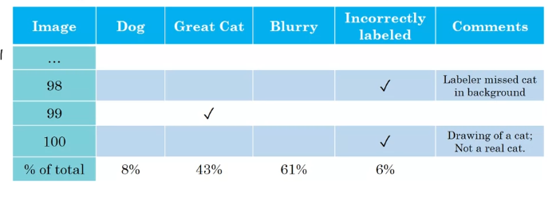
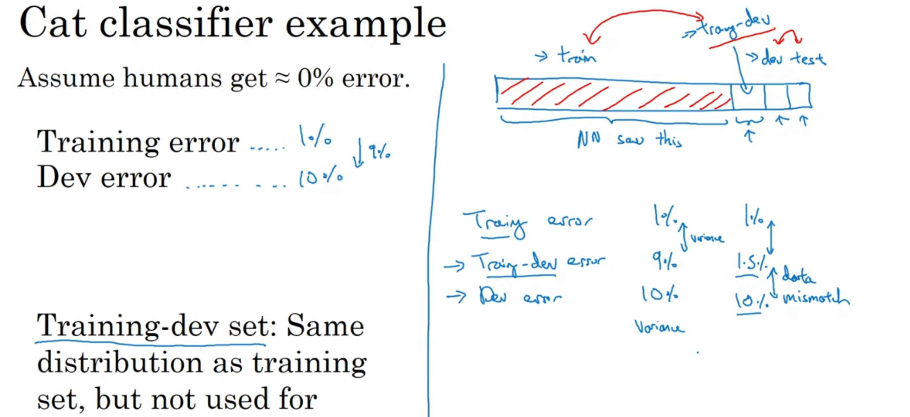
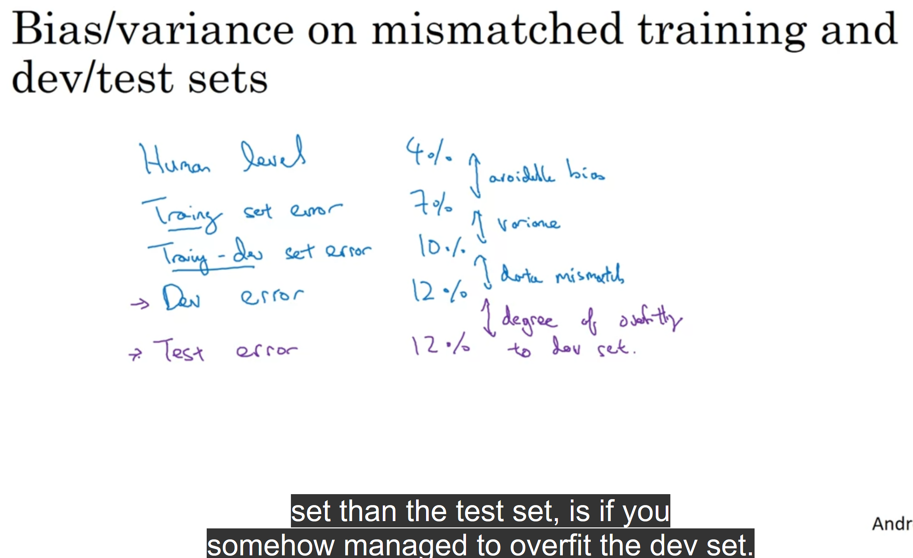
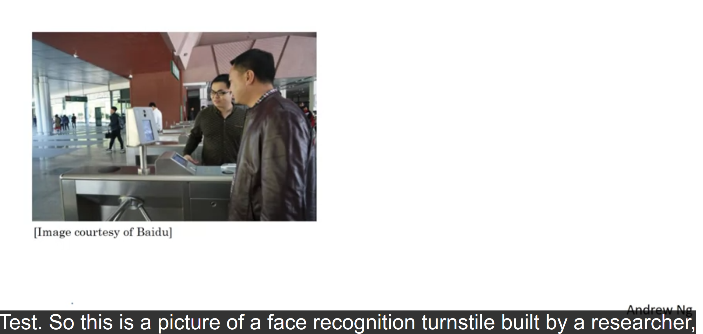
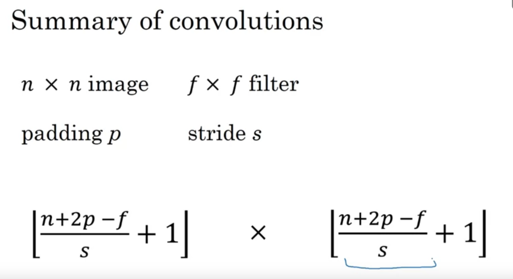
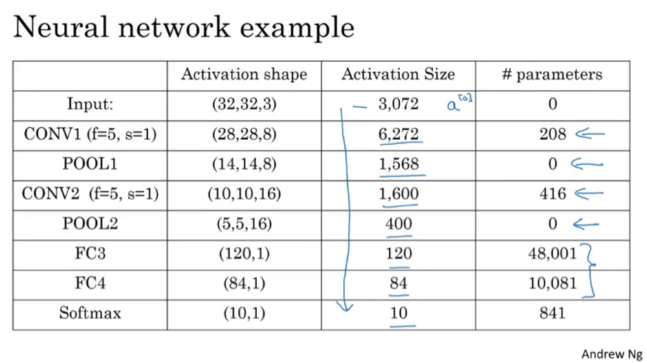

# Deep Learning Specialization 

[toc]

## Structuring Machine Learning Projects

F1 is the harmonic mean of p and r. 调和平均数

millisecond 毫秒 mɪlisekənd

wake words、trigger words唤醒词，比如siri

optimizing metric & statisfying metric 的经验：只设置一个优化目的，其他限制条件满足就行

dev set验证集

hit the bull's eye 击中靶心

But sometimes **partway** through a project 中途

pornographic 下流的

Indicator Function指示函数 

- 训练集可以和验证测试不一样的分布（反正无脑加样本就行），但是验证集和测试集必须同分布以保证效果的一致性。（我感觉现实中往往达不到）

- 不同的场景中需要定义不同的评估指标：比如说对pornographic很厌恶，那么需要将这些样本加重惩罚

images are blurrier  模糊 blɜːri

images not well framed 没有好好拍照的

- 如果训练验证集和评价指标表现很好，但是测试集不行，需要更换指标或者更换验证集
- 吴老师的经验：尽快先选定指标和训练验证集开始工作。如果之后发现有偏差，再换。这样效率更高

**have a well-defined target and iterate efficiently towards improving performance**

- Bayes optimal error 理论最优准确率 （永远达不到），一群专家的准确率
- 如果要求人类准确率human level performance来代替Bayes error：就需要用表现最好的专家，而不是专家的平均水平/专家与普通人的平均水平
- 超过人类准确率后，提升就比较缓慢了
- 如果训练和理论准确率bayes optimal error的gap更大，那try bias reduction tactics，比如train a larger network, train longer, better optimization algorithms RMSprop, Adam, NN architecture, hyperparameter search
- 如果验证准确率和训练准确率的gap更大，那就reduce variance，比如regularization(l2, dropout), get a bigger training set, data augmentation

##### 业务启示

- 如果项目时间很短，来了新数据：数据量很少：①用新评价指标和新的验证测试集再次训练；②数据增强、数据合成data augmentation/data synthesis
- 如果竞争对手再False Negative Rate表现更好：即使调整指标（根据NER经验我理解：什么时候停取决于FNR最低）

These examples may be a bit **contrived**.  预谋的; 不自然的; 人为的; 矫揉造作的; 做作的;  这是我举的不恰当的例子

bias avoidance tactics or variance avoidance tactics

There's quite a lot more **nuance** in how you factor in human level performance into how you make decisions in choosing what to focus on. 细微差别

surpassing a single radiologist, a single doctor's performance might mean the system is good enough to deploy in some **context**. 

- 机器比人类做的好的事情
- 不是三大领域的：online advertising, product recommendation, logistics(predicting transit time), loan approvals
- 比不上人类的Natural Perception Task：computer vision, speech recognition, or natural language processing 
- Medical tasks: read ECGs or diagnosing skin cancer 读心电图electrocardiogram

anomaly 异常事物；反常现象

That's what intrigued me about it  着迷，感兴趣[ɪnˈtriːɡd]

pretty like **painstaking work** 需要细心的，辛苦的，专注的（例如标注）

There is some superhumanness to it（我不知道人脑如何处理图像）

put all the research on hold 搁置所有研究

understand all the things that happen **under the hood** 在后台

The field will split into two **trajectories**.  AI的发展走向两个方向

It was implementing it myself from scratch that I felt gave me the best kind of **bang for the buck** in terms of understanding. 尽量设法获得更多的利润或价值（更多的打击for 美元）

You can work with it once you have written at something yourself **on the lowest detail**,至少也写点

I know that in machine learning, sometimes we **speak disparagingly of** hand engineering things, or using too much value insight 轻蔑

As you're **part way** through this process, sometimes you notice other categories of mistakes 一段时间后

#### 错例分析与统计

不仅可以知道哪类不行，还可以中途随时加入新的错误种类

也可以对标注样本标错的情况提示出来

But this quick counting procedure, can really help you make much better **prioritization decisions**, and understand how promising different approaches are to work on. 

可以选定优先方向，看到哪个方向会有前景。（这点的确对业务来说很重要！）

##### 业务启示

检查是否有标错的样本，但是事实上深度学习对标错的样本非常robust，不会刻意去学，因此没有必要。（只要是随机标错）但是系统性标错systematic errors不行，就像故意不标`local currency`一样

There is one **caveat** to this   告诫 [ˈkævi**æt**]

So I'd like to **wrap up with** just a couple of pieces of advice. 结束

accented speech 语音识别中（带有异国口音的，带有他乡腔调的）

And if sometimes the speaker **stutters** or if they use **nonsensical** phrases like oh, ah 口吃   无意义的

it might be okay to build a more complex system **from the get-go** by building on this large body of academic literature.  一开始的时候

just shoving it into the training set just to get it more training data.  **[ˈʃʌvɪŋ]** 猛推; 乱挤

 there's some subtleties 细微之处

speech activated rearview mirror 语音激活后视镜

#### 训练集和测试集可以不同

但是验证集和测试集需要一样，目的是为了探究在未知、新来数据集上的效果。例如：语音识别时用大量语料训练，但是最终落实在语音后视镜上。

也不一定非要用所有的数据。

如下图，**为了识别训练和验证集为什么准确率不一样**，解决方法为：1.在训练集内部划分出training-dev集，如果training-dev集的效果和dev集一样差，说明是模型过拟合造成准确率下降。如果本身training-dev集表现和训练集一样，则是验证集样本分布不同。

##### 业务启示

就像Coco经常反应模型效果下降，如果我们在训练的时候就已经划分出training-dev集，并且保证了模型没有过拟合的话，就是Coco选来的测试集的分布与咱们的分布不一样

这是每一种集合的作用，用来评估不同的错误类型。如果验证集和测试集效果不一样，则有可能模型刚好overfit to dev set

#### 人工数据合成

注意点：不能都用同一段噪音去合成，噪音也需要用不同的，否则会对噪音过拟合。

在音频上表现很好，但是自动驾驶汽车图像上需要防止只对一部分汽车过拟合。

And the challenge with artificial data synthesis is to the human ear, as far as your ears can tell, these 10,000 hours all sound the same as this one hour, so you might end up creating this very **impoverished** synthesized data set from a much smaller subset of the space without actually realizing it. 贫瘠的

radiology diagnosis 放射诊断

transfer learning=pre-training 除最后一层外的所有层+fine-tuning最后一层

- 什么时候用transfer-learning?
- when you have a lot of data for the problem you're transferring from and usually relatively less data for the problem you're transferring to. 

detecting curves, detecting edges

audio snippets 一小段音乐 

audio clip 音频片段，音频素材

maybe it won't hurt to include that 10 hours of data to your transfer learning, but you just wouldn't expect to get a meaningful gain. 

y is a four by one vector 是一个4×1的向量

四个输出而非四分类的区别：四个输出是用四个logistic loss衡量，预测四个目标，y是4×1的向量；而多分类时只有一种输出的可能

##### 业务启示

- 我们做NER的时候，7个实体，并不是当作7分类去做，而是7个目标，因此矩阵有一层维数为7，分别反向传播
- 节约资源与时间，业务很关注这一点！
- transfer learning适用于标注数据少的情况，因此在合同NER场景里，如果NER已经在大样本里与训练过，那么会带来很好的效果。

吴老师还说，对于数据部分标签有缺失的情况，通过shared low level features的方式，仍然可以有效运算，算损失时只计算有标签的每个样本四个标签中的有的的标签。（虽然不知道具体是怎么实现的，tf这么智能了吗？）

Rich Carona, found many years ago was that the only times multi-task learning hurts performance compared to training separate neural networks is if your neural network isn't big enough. 所以只要足够大的网络，multi-task learning就不是问题

But I would say that on average transfer learning is used much more today than multi-task learning, but both are useful tools to have in your **arsenal**. 武器库

Again, with some sort of computer vision, object detection examples being the most notable exception. 目前大部分还是transfer learning远多于multi-task learning，但除了目标检测的情形，一个网络学很多目标

phoneme [ˈfoʊniːm] 音素

a face recognition **turnstile** 旋转门

swipe an RFID badge 刷卡

pediatrician [ˌpiːdiəˈtrɪʃn] 儿科医生

But it's also not **panacea** [ˌpænəˈsiːə] 灵丹妙药

linguist 语言学家

Transcipt转译的时候，以前都是语言学家对音素phoneme定义好，但是端到端机器学习也许可以不按人类的思维学的更好

machine learning researchers tend to **speak disparagingly of** hand designing things. 轻蔑地

radar 雷达 lidar 激光雷达 [ai] 

steer your own car 转向 

be 

**be mindful of** where you apply end-to-end deep learning. 考虑到

make good **prioritization** decisions in terms of how to move forward on your machine learning project 优化的决定

windshield wiper 风挡刮水器

you would be able to hear their **siren**. [ˈsaɪrən] 警报器

I was going to work one morning, and I **bumped into** Geoff Hinton 无意中遇到

helped with this **resurgence** of neural networks and deep learning. 复兴

even if you don't end up building computer vision systems **per se**,  [ˌpɜːr ˈseɪ] 本身，亲自

The convolution operation is one of the fundamental **building blocks** of a convolutional neural network. 构成要素

[OpenCV边缘检测(Sobel,Scharr,Laplace,Canny)](https://blog.csdn.net/qq_34711208/article/details/81703341)

padding的参数：`valid`：不进行padding和`same`：保持输出和输出维数相同的padding

which is why we **wound up with** this is three by three output 以...告终

by convention 按照惯例

可以这样理解：正常来说，是n+2p-f+1，但如果步长s不为1，则需要s等分，并且首位都算。并且，需要向下取整来保证如果最后一次卷积超出边界的话就不算。因此是下图的结果

数学书上的卷积，是做上下、左右两次翻转（吴老师画错了），然后再去卷积的。因此实际我们深度学习中用的卷积是叫做互相关(*cross*-*correlation*)。

信号处理时的卷积之所以倒过来，是为了有(A\*B)\*C=A\*(B\*C)这样的性质，但对于深度学习来说，不需要这样的性质，叫做**associativity**，可结合性。

以前对多层卷积一直理解错了：其实每个3×3×3的卷积核只会得到一个2维的4×4，如果训练两个卷积核就会得到4×4×2的输出，以此类推。

多层卷积：有几层要用**channel**不要用**depth**，**depth**容易和神经网络的深度混淆。

最后，卷积后真正的输出是加bias b并且用relu函数的结果

So these is really one property of convolution neural network that **makes it less** **prone to overfitting** . 

- 网络走的越深，w宽度和h高度越窄，channels越多
- 一个或者多个卷积层后面会加一个池化层

So we'll do that next week, but **before wrapping this week's videos** **just one last thing which is** 结束这周

#### 参数个数

吴老师图里写错了

1. 208 should be (5\*5\*3 + 1) \* 8 = 608  很重要！！！
2. 416 should be (5\*5\*8 + 1) \* 16 = 3216

3. In the FC3, 48001 should be 400\*120 + 120 = 48120, since the bias should have 120 parameters, not 1 很重要！！！

4. Similarly, in the FC4, 10081 should be 120*84 + 84 (not 1) = 10164

(Here, the bias is for the fully connected layer.  In fully connected layers, there will be one bias for each neuron, so the bias become In FC3 there were 120 neurons so 120 biases.)

5. Finally, in the softmax, 841 should be 84*10 + 10 = 850

#### 使用卷积的好处

- parameter sharing 节约参数，每个像素只和周围一圈像素有关
- sparsity of connections 不像全连接，无论物体在图片中的任何位置，都可以用filter探测到

