# SQL

- [SQL](#sql)
    - [Week1结课练习](#week1结课练习)
    - [Week2知识点](#week2知识点)
    - [Week3知识点](#week3知识点)

学习CTE

### Week1结课练习

案例背景：

有的user是被删除deleted_at，有的user是被合并merge_at，并且合并时会有parent_user_id概诉你我当前的id被并到了哪个parent上。我们想通过该表求出每天的用户增长。

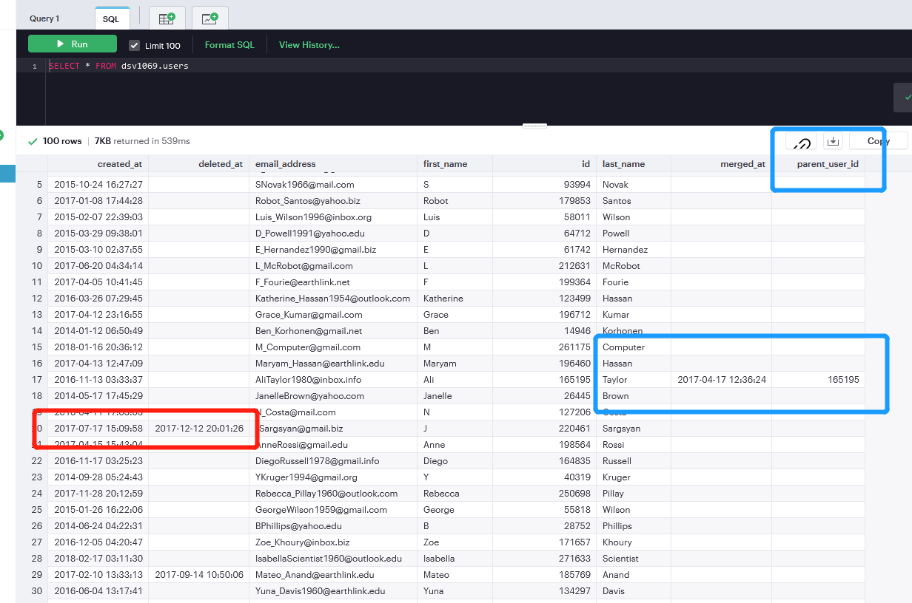


首先，查看数据是什么样子的，发现即使合并也有的id和parent_user_id是一模一样的，这说明判断合并是，是两个同时并到一个上。其中：一个id得以保留，但也会留下相同时间的merged_at的记录；另一个的id消失，合并到对方身上。

可以预料到的是：将来我们把合并的人去掉的时候，每两个merged_at实际对应只少掉了一个人。一种解决方法是：利用id!=parent_user_id来过滤出因merge少掉人的情况。


接下来，查看一天中会有多少用户合并，并画出图像。简简单单的按时间戳排序是不现实的，我们希望要按天排序，因此加上函数date()。到此为止，并没有解决deleted_at和merged_at的问题，但我们也需要循序渐进慢慢来。


接下来是一个**易错点**，这时我们先简单地解决这个问题：我先把删除和合并的情况排除掉，只看他们不为空的情况。由于前面已经说过，可以通过id!=parent_user_id来过滤掉删除的情形，但观察下图的结果，数量比我们想的少很多。回到第一张图可以看见，由于parent_user_id大部分情况下是空，因此我们在用id!=parent_user_id排除合并的情形时，把正常的也不小心排除了。因此这里得加入OR parent_user_id is null来限制，最后别忘了在条件里加上括号。


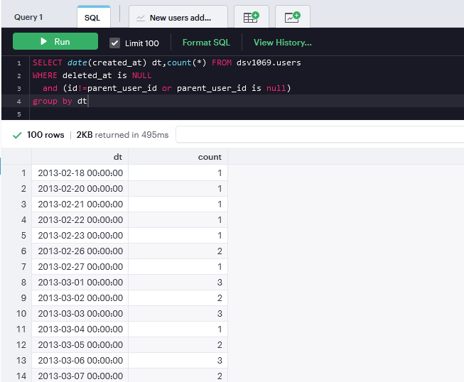

接下来查看删除的情况，由于长得和created_at很像，因此把他俩join起来。此时由于deleted_at并不是每天都有，因此join完毕后肯定是有空值的，而且此时一定是一个left join。

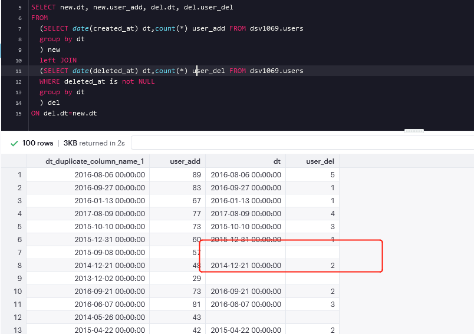

接下来，把被合并的情况要考虑进来。此时取被合并的情况，条件一定是：

```sql
WHERE id!=parent_user_id AND parent_user_id  IS NOT NULL
```

然后，把这一段代码和上述的一起join起来，此时仍然应该是Left join。得到如下的表格。但此时仍然有很多空值。此时只差最后一步了：把所有结果合并起来。

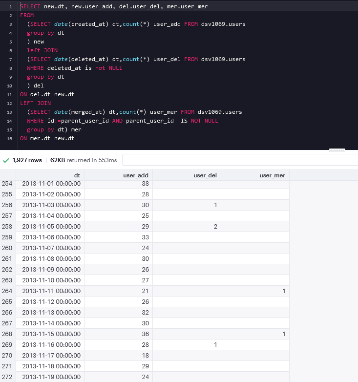


**注意点**：如果直接相减，只要有空值，减出来的结果就是空，如下图所示。为了把空值变成0，需要用COALESCE函数（如果空就变成aaa），然后再相减。


**易错点**：新命名的变量可以on可以groupby，但不能where，也不能相减


源码:

```sql
SELECT new.dt, new.user_add AS u_add, 
  COALESCE(del.user_del,0) AS u_del, 
  COALESCE(mer.user_mer,0) AS u_mer,
  new.user_add-COALESCE(del.user_del,0)-COALESCE(mer.user_mer,0) AS net_add
FROM
  (SELECT date(created_at) dt,count(*) user_add FROM dsv1069.users
  group by dt
  ) new
  left JOIN 
  (SELECT date(deleted_at) dt,count(*) user_del FROM dsv1069.users
  WHERE deleted_at is not NULL 
  group by dt
  ) del 
ON del.dt=new.dt
LEFT JOIN 
  (SELECT date(merged_at) dt,count(*) user_mer FROM dsv1069.users
  WHERE id!=parent_user_id AND parent_user_id  IS NOT NULL
  group by dt) mer
ON mer.dt=new.dt
```

### Week2知识点

通过CREATE TABLE xxx AS + SELECT 的方式创建表

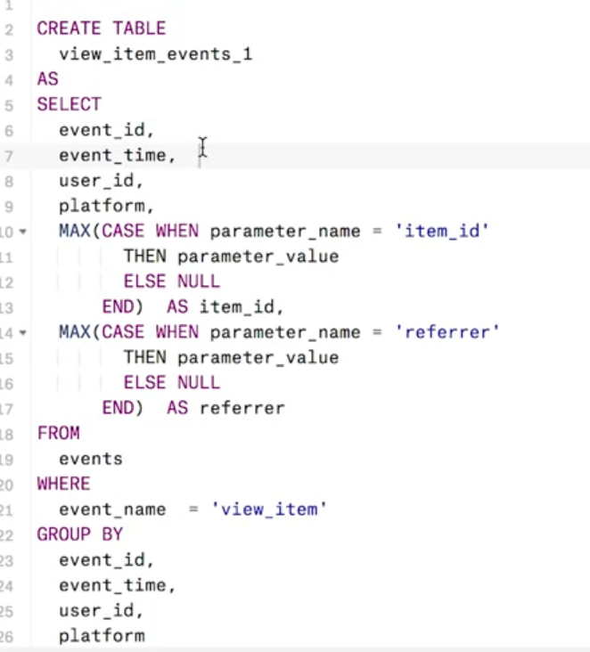

通过describe 表aaa这个函数来看是否有空值

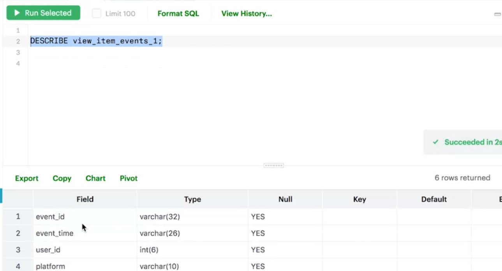

如果不存在则创建表，


用replace into （MySQL特定）（Hive: insert overwrite）代替insert into 可以将原有的数据全部替换。

Liquid Tag来设置一个变量


如果是想取哪天的表，因此就把当天的日期还有所有那天的记录，存在取下来的表中

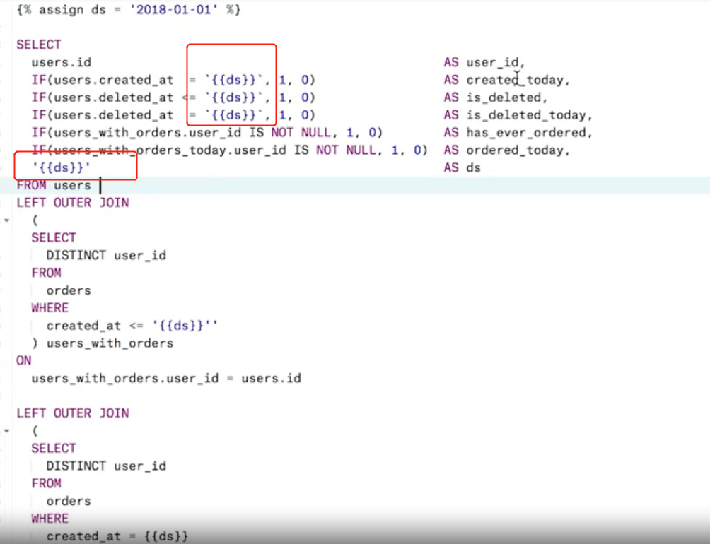

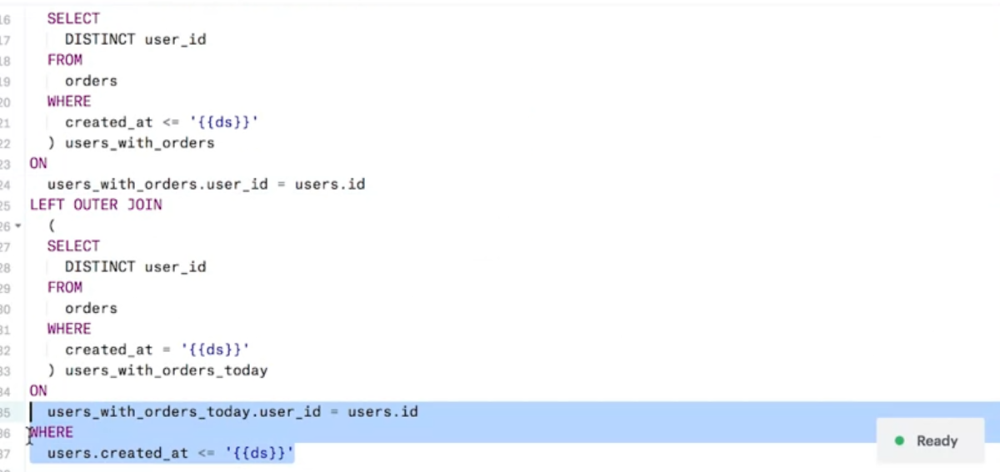

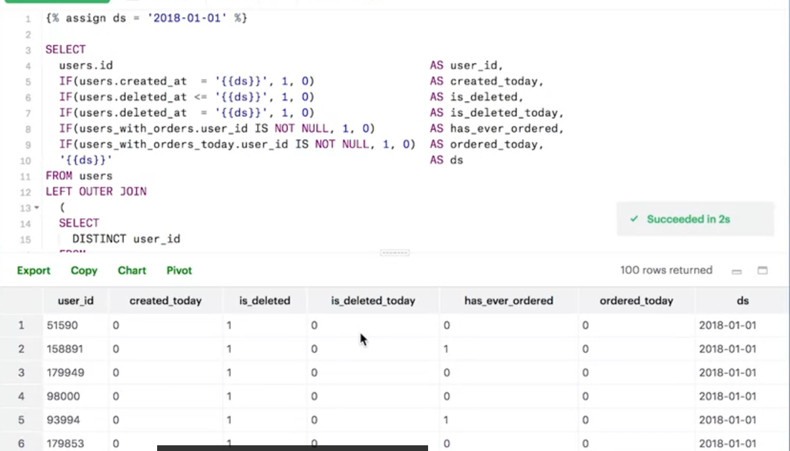

### Week3知识点

有一个日期表dates_rollup专门存储日期，包括当天，七天以前，28天以前。

要求daily roll-up, weekly roll-up, monthly roll-up

最后外面用括号圈起来的目的是只看有数据的部分（由于where不能与新命名的列同时用）


当计算七天的平均时，只需要修改ON的条件，由原先的等于改成处于两个时间点之间。

这样就可以保证不管真实情况是否有7条数据（例如python中肯定是rolling(7).sum()）都会严格的按照真实的7天去取数据。（虽然现在python支持rolling('7D').sum()）

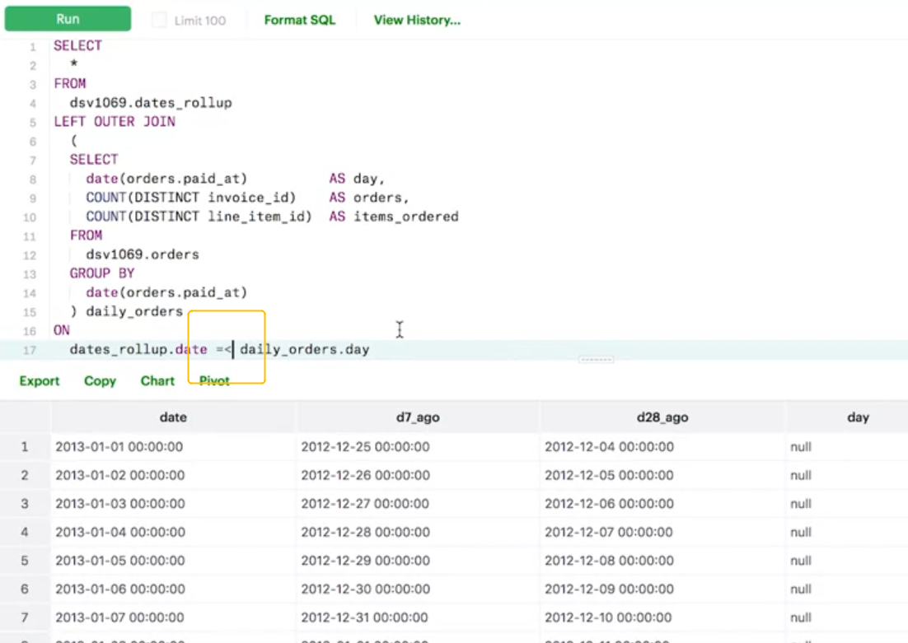

最终得到如下的weekly roll-up的表。此外，我们还可以顺便把最外面一层group by每次到底group了多少个单独拿出来看一眼。如蓝色框所示，果然group了7个。

**注意**，这个7并不是我ON的条件有七天所以是7，而是实际我一个Group中合并了几个数，就是几。可能会有这样的疑惑：我不是都往前找7天吗？根本原因是：左表确实是每一天都不缺，但是我并上来是在坐表的每一行的限定条件下找到右表合适的列并入左表的每一行。因此在前期，右表不是每天都有数，就不会是7。

由于使用了desc只能看到最后的数据，但是开始几年的数据都是1-7之间的，是真实的我group by中有几个就是几，详见第二张图。

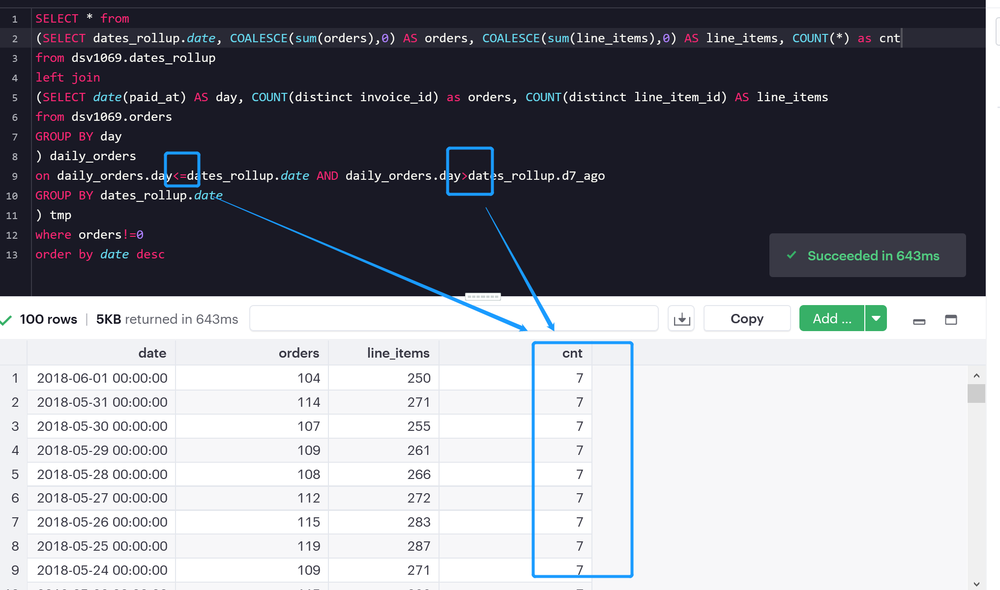

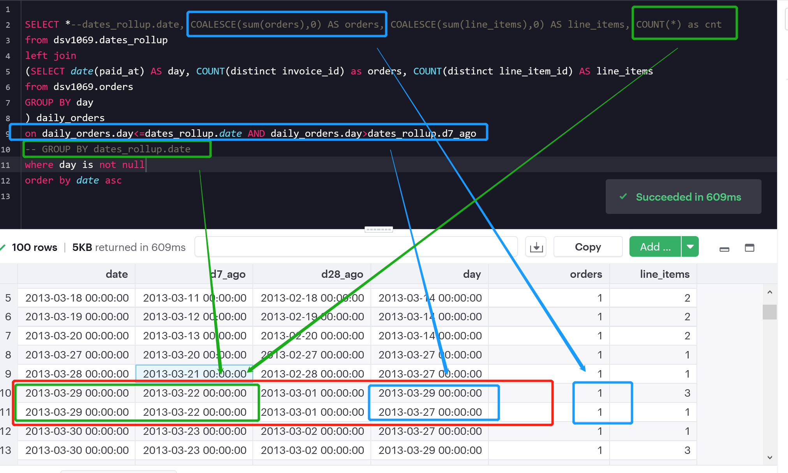

#### 窗口函数 Windowing Function

rank, dense_rank, row_number

ROW_NUMBER()是排序，当存在相同成绩的学生时，ROW_NUMBER()会依次进行排序，他们序号不相同，也就是1234一直排下去。相同时，就依照原本出现的顺序。

RANK()，如果相同的话，会是1134

DENSE_RANK()，如果相同的话，会是1123。dense密集的，也就是不跳跃

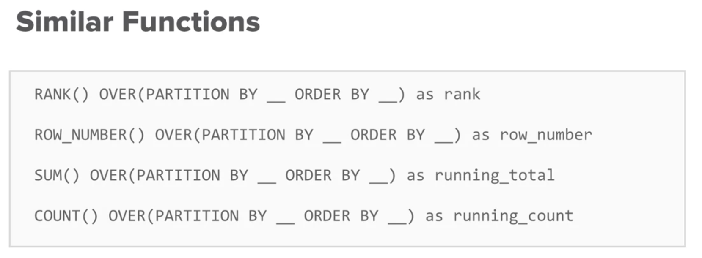

partition by 相当于group by

这样的好处是：你可以看见每一个组里的结果，平时我们用group by最终只会输出一条结果，但是用窗口函数可以保留所有的结果。窗口函数类似于pandas中的的transform函数（会保留所有行），就像groupby类似于pandas中的groupby+agg函数（只保留一行）。参考http://joyfulpandas.datawhale.club/Content/ch4.html#id5

例如这边

```sql
dense_rank() over (partition by user_id order by event_time DESC) as rank
```

就可以写成

```python
view_item_events['rank']=view_item_events.groupby('user_id')['event_time'].rank(ascending=False,method='dense')
```

rank（）函数参数设置

1.**method** : {‘average’, ‘min’, ‘max’, ‘first’, ‘dense’}, default ‘average’ 主要用来当排序时存在相同值参数设置；

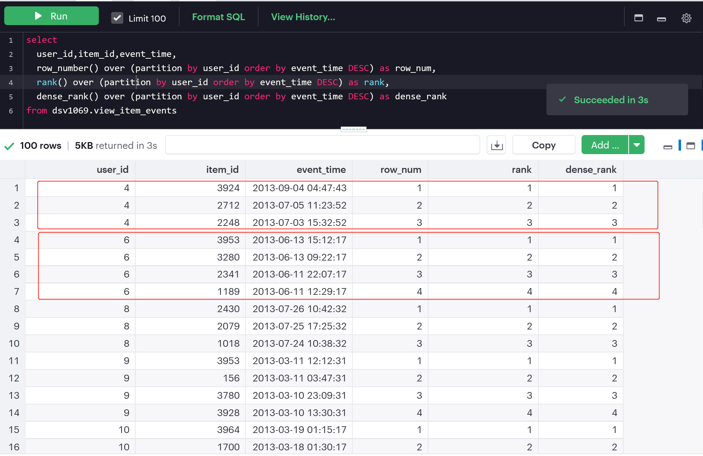

**实际应用**：我想要给浏览过某商品的人推动广告，但是不想给已经购买他们的人推送该广告。首先，肯定有recent_views表作为左表，通过ROW_NUMBER只取最远的一次浏览记录，然后users表和items表分别join上来。还要考虑到不能给已经删除的用户发邮件。接下来是重点：不想给已经购买他们的人推送该广告

这是一个非常tricky的点，也就是怎么通过来只留下A中有的而B中没有的。

首先的肯定是要把orders表join到总表上，但是对于右表orders来说，在where中设置orders.item_id也就是ON的右键为空，这就排除的右表。


最终效果：

分解步骤1：


分解步骤2：并上三个表

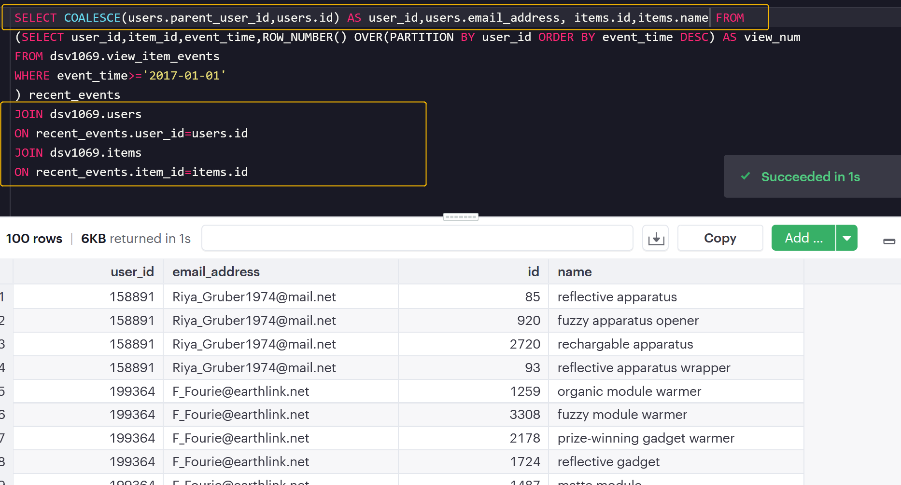

分解步骤3：再添加上不给删除的客户，不给购买过的客户（需要并上orders表）发邮件，且距离已经看过的时间最远的商品的限制条件。

**易错点**：如果要最远的一条数据，要在最开始的表里先用ROW_NUMBER()画出列，直到最后在where条件中再去过滤；最后一步join order表是left join；已经删除的客户deleted_at是有值的，没有删除的人deleted_at是空，不要反了；选取在左表且不在orders表的数据时，用left join且orders.item_id is null即可

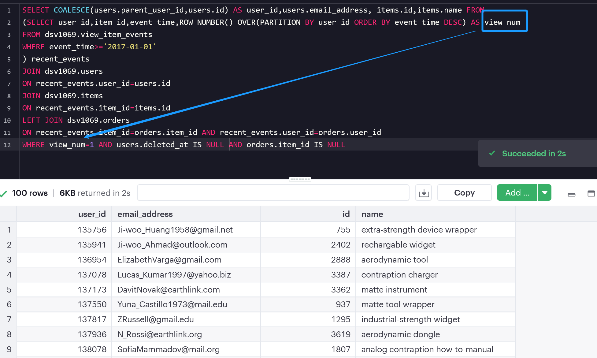

```sql
SELECT
  COALESCE(users.parent_user_id, users.id) AS user_id,
  users.email_address,
  items.id,
  items.name
FROM
  (
    SELECT
      user_id,
      item_id,
      event_time,
      ROW_NUMBER() OVER(
        PARTITION BY user_id
        ORDER BY
          event_time DESC
      ) AS view_num
    FROM
      dsv1069.view_item_events
    WHERE
      event_time >= '2017-01-01'
  ) recent_events
  JOIN dsv1069.users ON recent_events.user_id = users.id
  JOIN dsv1069.items ON recent_events.item_id = items.id
  LEFT JOIN dsv1069.orders ON recent_events.item_id = orders.item_id
  AND recent_events.user_id = orders.user_id
WHERE
  view_num = 1
  AND users.deleted_at IS NULL
  AND orders.item_id IS NULL
```


**实际应用2**：我们想了解所有二次购买的客户里，第一次和第二次购买所相间隔的时间。

重点：date函数的使用；first_order和second_order长得一样的合并，不在on而是在where中限定出前一个时间和后一个时间；dense_rank使用；如果是hive就可以用datediff函数；子查询要给子表写名字

```sql
SELECT
  first_order.user_id,
  date(first_order.paid_at) AS pay1,
  date(second_order.paid_at) AS pay2,
  date(second_order.paid_at) - date(first_order.paid_at) AS date_diff
FROM
  (
    SELECT
      user_id,
      paid_at,
      dense_rank() over(
        PARTITION by user_id
        ORDER BY
          paid_at ASC
      ) AS order_num
    FROM
      dsv1069.orders
  ) first_order
  JOIN (
    SELECT
      user_id,
      paid_at,
      dense_rank() over(
        PARTITION by user_id
        ORDER BY
          paid_at ASC
      ) AS order_num
    FROM
      dsv1069.orders
  ) second_order ON first_order.user_id = second_order.user_id
WHERE
  first_order.order_num = 1
  AND second_order.order_num = 2
```


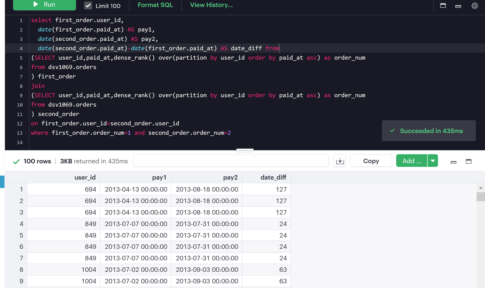

### Week4练习

目的是已经安排好了一个abtest，有test_id和test_assignment。想要探究是否一个用户会在abtest之后下单。

**巧妙之处在于**：面试官会告诉你哪天做了实验event_table，order表是怎么样的。你要反应过来：谁跟谁并表，我通过比较日期得出是否下单

要求：如果一个用户没有下单，我们也要有一个数值为0的行来表示下单数为0；如果不在本次实验中的用户不应该被包括进来。

前期要点：CAST函数分配类型；CASE WHEN aaa THEN bbb ELSE ccc END最后一个END别忘。

分解步骤1：取表


分解步骤2：并上orders表后，通过时间来判断是否在实验日期之后下单。但是会发现有重复的操作（一次下单两件商品），因此再group by其他列并对这一列取max！！！**这个方法很实用**


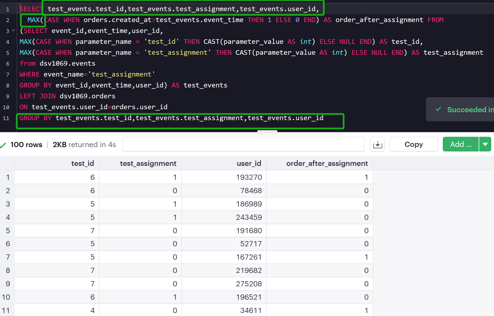

进一步的一个实验：想要得到下了多少单，多少发票，多少line_items，总收入为多少

**注意点**：遇到类似情况时，永远不要忘记DISTINCT, count(distinct xxx)

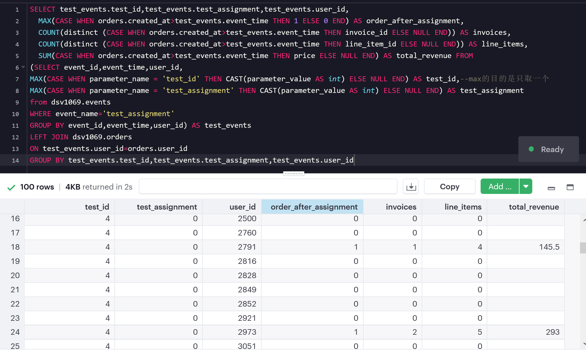

```sql
SELECT
  test_events.test_id,
  test_events.test_assignment,
  test_events.user_id,
  MAX(
    CASE
      WHEN orders.created_at > test_events.event_time THEN 1
      ELSE 0
    END
  ) AS order_after_assignment,
  COUNT(
    DISTINCT (
      CASE
        WHEN orders.created_at > test_events.event_time THEN invoice_id
        ELSE NULL
      END
    )
  ) AS invoices,
  COUNT(
    DISTINCT (
      CASE
        WHEN orders.created_at > test_events.event_time THEN line_item_id
        ELSE NULL
      END
    )
  ) AS line_items,
  SUM(
    CASE
      WHEN orders.created_at > test_events.event_time THEN price
      ELSE NULL
    END
  ) AS total_revenue
FROM
  (
    SELECT
      event_id,
      event_time,
      user_id,
      MAX(
        CASE
          WHEN parameter_name = 'test_id' THEN CAST(parameter_value AS int)
          ELSE NULL
        END
      ) AS test_id,
      --max的目的是只取一个
      MAX(
        CASE
          WHEN parameter_name = 'test_assignment' THEN CAST(parameter_value AS int)
          ELSE NULL
        END
      ) AS test_assignment
    FROM
      dsv1069.events
    WHERE
      event_name = 'test_assignment'
    GROUP BY
      event_id,
      event_time,
      user_id
  ) AS test_events
  LEFT JOIN dsv1069.orders ON test_events.user_id = orders.user_id
GROUP BY
  test_events.test_id,
  test_events.test_assignment,
  test_events.user_id
```

进一步的实验：我不仅要将来购买，还想要限定在30天以内的数据。如蓝框所示，这让我想起来了崔凡之前做的题目：和30天还有60天的数据比较。结论：但如果要保留日期列的话还是得join，如果单纯看用户可以不用join，直接order表join到user表后，groupby后每一个组内比较日期即可。

**要点**：差30天：DATE_PART(’day‘,a-b)<=30

