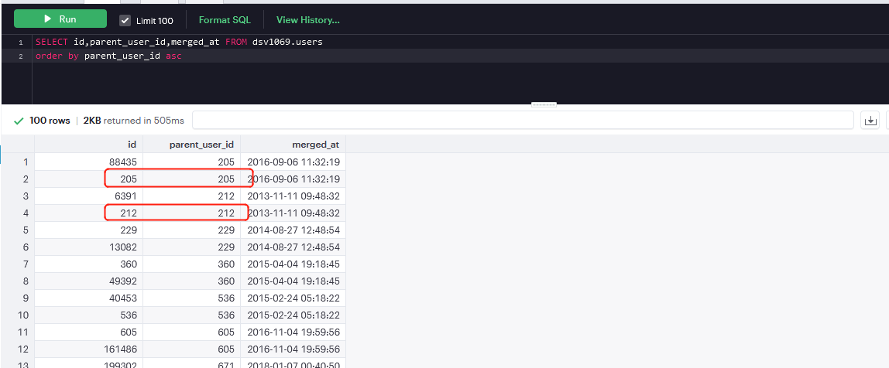
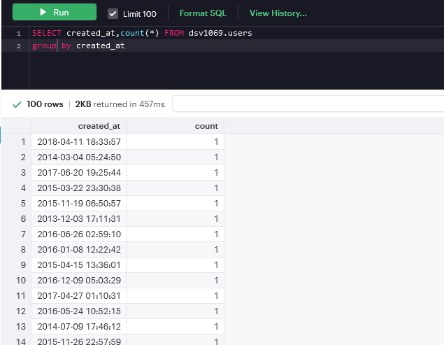
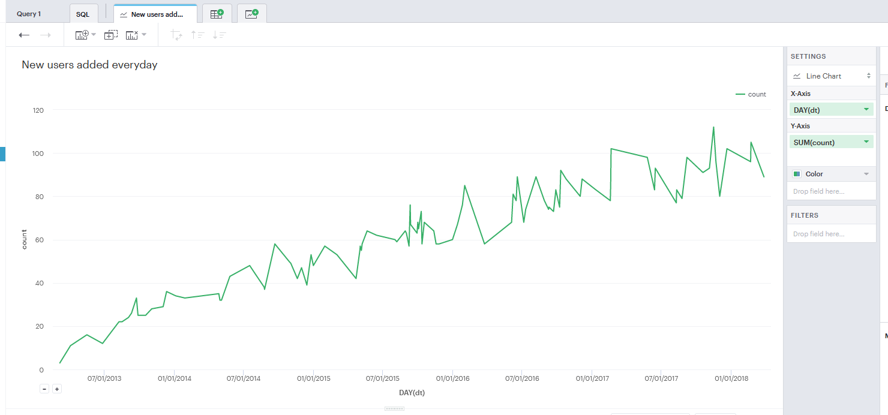
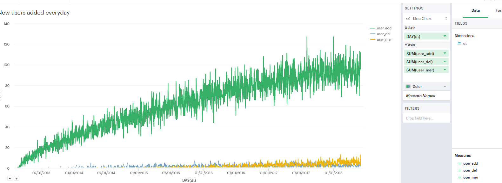
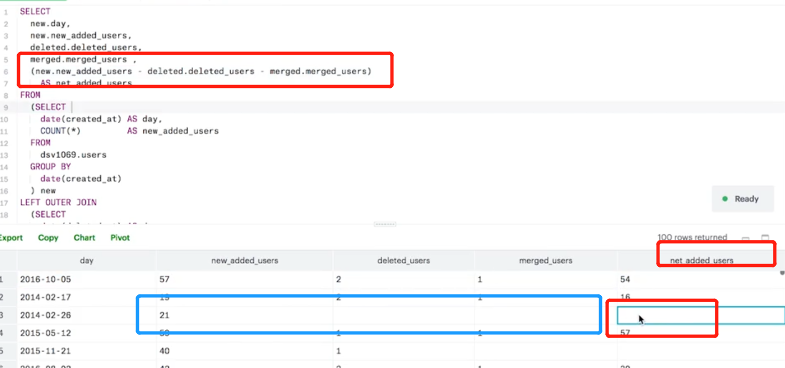
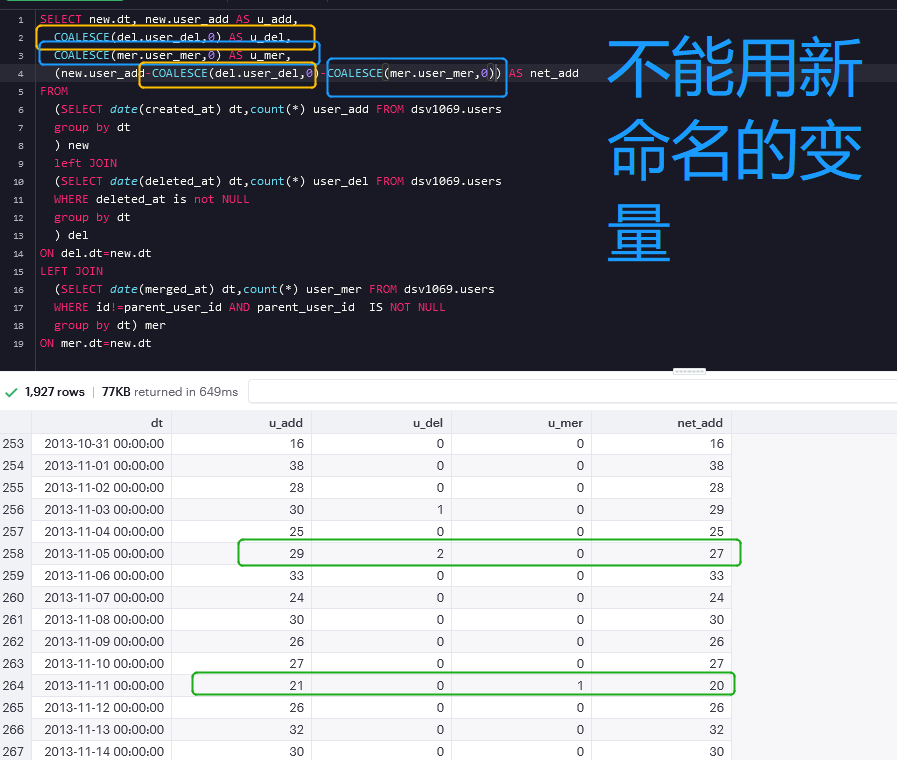

# SQL

## 结课练习

案例背景：

有的user是被删除deleted_at，有的user是被合并merge_at，并且合并时会有parent_user_id概诉你我当前的id被并到了哪个parent上。我们想通过该表求出每天的用户增长。


首先，查看数据是什么样子的，发现即使合并也有的id和parent_user_id是一模一样的，这说明判断合并是，是两个同时并到一个上。其中：一个id得以保留，但也会留下相同时间的merged_at的记录；另一个的id消失，合并到对方身上。

可以预料到的是：将来我们把合并的人去掉的时候，每两个merged_at实际对应只少掉了一个人。一种解决方法是：利用id!=parent_user_id来过滤出因merge少掉人的情况。



接下来，查看一天中会有多少用户合并，并画出图像。简简单单的按时间戳排序是不现实的，我们希望要按天排序，因此加上函数date()。到此为止，并没有解决deleted_at和merged_at的问题，但我们也需要循序渐进慢慢来。







接下来是一个**易错点**，这时我们先简单地解决这个问题：我先把删除和合并的情况排除掉，只看他们不为空的情况。由于前面已经说过，可以通过id!=parent_user_id来过滤掉删除的情形，但观察下图的结果，数量比我们想的少很多。回到第一张图可以看见，由于parent_user_id大部分情况下是空，因此我们在用id!=parent_user_id排除合并的情形时，把正常的也不小心排除了。因此这里得加入OR parent_user_id is null来限制，最后别忘了在条件里加上括号。


接下来查看删除的情况，由于长得和created_at很像，因此把他俩join起来。此时由于deleted_at并不是每天都有，因此join完毕后肯定是有空值的，而且此时一定是一个left join。


接下来，把被合并的情况要考虑进来。此时取被合并的情况，条件一定是：

```sqlite
WHERE id!=parent_user_id AND parent_user_id  IS NOT NULL
```

然后，把这一段代码和上述的一起join起来，此时仍然应该是Left join。得到如下的表格。但此时仍然有很多空值。此时只差最后一步了：把所有结果合并起来。




**注意点**：如果直接相减，只要有空值，减出来的结果就是空，如下图所示。为了把空值变成0，需要用COALESCE函数（如果空就变成aaa），然后再相减。



**易错点**：新命名的变量可以on可以groupby，但不能where，也不能相减



源码:

```sqlite
SELECT new.dt, new.user_add AS u_add, 
  COALESCE(del.user_del,0) AS u_del, 
  COALESCE(mer.user_mer,0) AS u_mer,
  new.user_add-COALESCE(del.user_del,0)-COALESCE(mer.user_mer,0) AS net_add
FROM
  (SELECT date(created_at) dt,count(*) user_add FROM dsv1069.users
  group by dt
  ) new
  left JOIN 
  (SELECT date(deleted_at) dt,count(*) user_del FROM dsv1069.users
  WHERE deleted_at is not NULL 
  group by dt
  ) del 
ON del.dt=new.dt
LEFT JOIN 
  (SELECT date(merged_at) dt,count(*) user_mer FROM dsv1069.users
  WHERE id!=parent_user_id AND parent_user_id  IS NOT NULL
  group by dt) mer
ON mer.dt=new.dt
```


