# Deep Learning Specialization 

[toc]

## Structuring Machine Learning Projects

F1 is the harmonic mean of p and r. 调和平均数

millisecond 毫秒 mɪlisekənd

wake words、trigger words唤醒词，比如siri

optimizing metric & statisfying metric 的经验：只设置一个优化目的，其他限制条件满足就行

dev set验证集

hit the bull's eye 击中靶心

But sometimes **partway** through a project 中途

pornographic 下流的

Indicator Function指示函数 

- 训练集可以和验证测试不一样的分布（反正无脑加样本就行），但是验证集和测试集必须同分布以保证效果的一致性。（我感觉现实中往往达不到）

- 不同的场景中需要定义不同的评估指标：比如说对pornographic很厌恶，那么需要将这些样本加重惩罚


images are blurrier  模糊 blɜːri

images not well framed 没有好好拍照的

- 如果训练验证集和评价指标表现很好，但是测试集不行，需要更换指标或者更换验证集
- 吴老师的经验：尽快先选定指标和训练验证集开始工作。如果之后发现有偏差，再换。这样效率更高

**have a well-defined target and iterate efficiently towards improving performance**

- Bayes optimal error 理论最优准确率 （永远达不到），一群专家的准确率
- 如果要求人类准确率human level performance来代替Bayes error：就需要用表现最好的专家，而不是专家的平均水平/专家与普通人的平均水平
- 超过人类准确率后，提升就比较缓慢了
- 如果训练和理论准确率bayes optimal error的gap更大，那try bias reduction tactics，比如train a larger network, train longer, better optimization algorithms RMSprop, Adam, NN architecture, hyperparameter search
- 如果验证准确率和训练准确率的gap更大，那就reduce variance，比如regularization(l2, dropout), get a bigger training set, data augmentation

##### 业务启示

- 如果项目时间很短，来了新数据：数据量很少：①用新评价指标和新的验证测试集再次训练；②数据增强、数据合成data augmentation/data synthesis
- 如果竞争对手再False Negative Rate表现更好：即使调整指标（根据NER经验我理解：什么时候停取决于FNR最低）


These examples may be a bit **contrived**.  预谋的; 不自然的; 人为的; 矫揉造作的; 做作的;  这是我举的不恰当的例子

bias avoidance tactics or variance avoidance tactics

There's quite a lot more **nuance** in how you factor in human level performance into how you make decisions in choosing what to focus on. 细微差别

surpassing a single radiologist, a single doctor's performance might mean the system is good enough to deploy in some **context**. 

- 机器比人类做的好的事情
- 不是三大领域的：online advertising, product recommendation, logistics(predicting transit time), loan approvals
- 比不上人类的Natural Perception Task：computer vision, speech recognition, or natural language processing 
- Medical tasks: read ECGs or diagnosing skin cancer 读心电图electrocardiogram


anomaly 异常事物；反常现象

That's what intrigued me about it  着迷，感兴趣[ɪnˈtriːɡd]

pretty like **painstaking work** 需要细心的，辛苦的，专注的（例如标注）

There is some superhumanness to it（我不知道人脑如何处理图像）

put all the research on hold 搁置所有研究

understand all the things that happen **under the hood** 在后台

The field will split into two **trajectories**.  AI的发展走向两个方向

It was implementing it myself from scratch that I felt gave me the best kind of **bang for the buck** in terms of understanding. 尽量设法获得更多的利润或价值（更多的打击for 美元）

You can work with it once you have written at something yourself **on the lowest detail**,至少也写点

I know that in machine learning, sometimes we **speak disparagingly of** hand engineering things, or using too much value insight 轻蔑

As you're **part way** through this process, sometimes you notice other categories of mistakes 一段时间后

#### 错例分析与统计

不仅可以知道哪类不行，还可以中途随时加入新的错误种类


也可以对标注样本标错的情况提示出来


But this quick counting procedure, can really help you make much better **prioritization decisions**, and understand how promising different approaches are to work on. 

可以选定优先方向，看到哪个方向会有前景。（这点的确对业务来说很重要！）

##### 业务启示

检查是否有标错的样本，但是事实上深度学习对标错的样本非常robust，不会刻意去学，因此没有必要。（只要是随机标错）但是系统性标错systematic errors不行，就像故意不标`local currency`一样

There is one **caveat** to this   告诫 [ˈkævi**æt**]

So I'd like to **wrap up with** just a couple of pieces of advice. 结束

accented speech 语音识别中（带有异国口音的，带有他乡腔调的）

And if sometimes the speaker **stutters** or if they use **nonsensical** phrases like oh, ah 口吃   无意义的

it might be okay to build a more complex system **from the get-go** by building on this large body of academic literature.  一开始的时候

just shoving it into the training set just to get it more training data.  **[ˈʃʌvɪŋ]** 猛推; 乱挤

 there's some subtleties 细微之处

speech activated rearview mirror 语音激活后视镜

#### 训练集和测试集可以不同

但是验证集和测试集需要一样，目的是为了探究在未知、新来数据集上的效果。例如：语音识别时用大量语料训练，但是最终落实在语音后视镜上。

也不一定非要用所有的数据。

如下图，**为了识别训练和验证集为什么准确率不一样**，解决方法为：1.在训练集内部划分出training-dev集，如果training-dev集的效果和dev集一样差，说明是模型过拟合造成准确率下降。如果本身training-dev集表现和训练集一样，则是验证集样本分布不同。

##### 业务启示

就像Coco经常反应模型效果下降，如果我们在训练的时候就已经划分出training-dev集，并且保证了模型没有过拟合的话，就是Coco选来的测试集的分布与咱们的分布不一样


这是每一种集合的作用，用来评估不同的错误类型。如果验证集和测试集效果不一样，则有可能模型刚好overfit to dev set


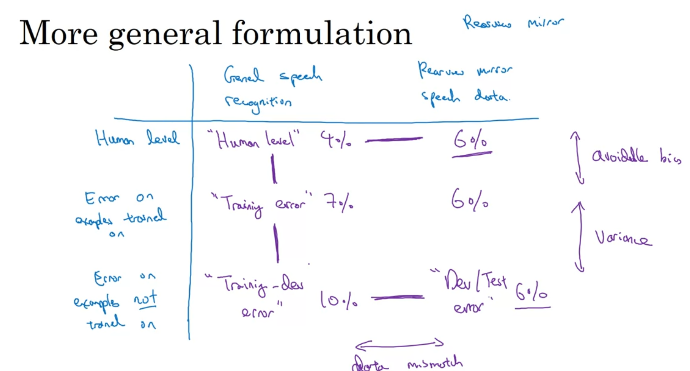

#### 人工数据合成

注意点：不能都用同一段噪音去合成，噪音也需要用不同的，否则会对噪音过拟合。

在音频上表现很好，但是自动驾驶汽车图像上需要防止只对一部分汽车过拟合。


And the challenge with artificial data synthesis is to the human ear, as far as your ears can tell, these 10,000 hours all sound the same as this one hour, so you might end up creating this very **impoverished** synthesized data set from a much smaller subset of the space without actually realizing it. 贫瘠的

radiology diagnosis 放射诊断

transfer learning=pre-training 除最后一层外的所有层+fine-tuning最后一层

- 什么时候用transfer-learning?
- when you have a lot of data for the problem you're transferring from and usually relatively less data for the problem you're transferring to. 

detecting curves, detecting edges

audio snippets 一小段音乐 

audio clip 音频片段，音频素材

maybe it won't hurt to include that 10 hours of data to your transfer learning, but you just wouldn't expect to get a meaningful gain. 

y is a four by one vector 是一个4×1的向量

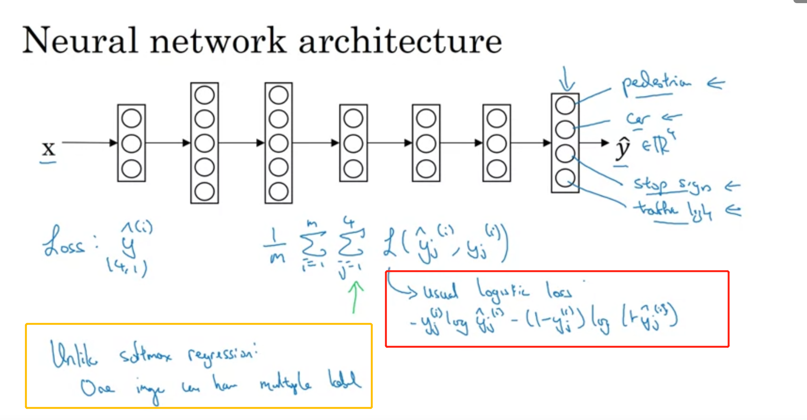

四个输出而非四分类的区别：四个输出是用四个logistic loss衡量，预测四个目标，y是4×1的向量；而多分类时只有一种输出的可能

##### 业务启示

- 我们做NER的时候，7个实体，并不是当作7分类去做，而是7个目标，因此矩阵有一层维数为7，分别反向传播
- 节约资源与时间，业务很关注这一点！
- transfer learning适用于标注数据少的情况，因此在合同NER场景里，如果NER已经在大样本里与训练过，那么会带来很好的效果。

吴老师还说，对于数据部分标签有缺失的情况，通过shared low level features的方式，仍然可以有效运算，算损失时只计算有标签的每个样本四个标签中的有的的标签。（虽然不知道具体是怎么实现的，tf这么智能了吗？）

Rich Carona, found many years ago was that the only times multi-task learning hurts performance compared to training separate neural networks is if your neural network isn't big enough. 所以只要足够大的网络，multi-task learning就不是问题

But I would say that on average transfer learning is used much more today than multi-task learning, but both are useful tools to have in your **arsenal**. 武器库

Again, with some sort of computer vision, object detection examples being the most notable exception. 目前大部分还是transfer learning远多于multi-task learning，但除了目标检测的情形，一个网络学很多目标

phoneme [ˈfoʊniːm] 音素

a face recognition **turnstile** 旋转门


swipe an RFID badge 刷卡

pediatrician [ˌpiːdiəˈtrɪʃn] 儿科医生

But it's also not **panacea** [ˌpænəˈsiːə] 灵丹妙药

linguist 语言学家

Transcipt转译的时候，以前都是语言学家对音素phoneme定义好，但是端到端机器学习也许可以不按人类的思维学的更好

machine learning researchers tend to **speak disparagingly of** hand designing things. 轻蔑地

radar 雷达 lidar 激光雷达 [ai] 

steer your own car 转向 

**be mindful of** where you apply end-to-end deep learning. 考虑到

make good **prioritization** decisions in terms of how to move forward on your machine learning project 优化的决定

windshield wiper 风挡刮水器

you would be able to hear their **siren**. [ˈsaɪrən] 警报器

I was going to work one morning, and I **bumped into** Geoff Hinton 无意中遇到

helped with this **resurgence** of neural networks and deep learning. 复兴

even if you don't end up building computer vision systems **per se**,  [ˌpɜːr ˈseɪ] 本身，亲自

The convolution operation is one of the fundamental **building blocks** of a convolutional neural network. 构成要素

## CV

[OpenCV边缘检测(Sobel,Scharr,Laplace,Canny)](https://blog.csdn.net/qq_34711208/article/details/81703341)

padding的参数：`valid`：不进行padding和`same`：保持输出和输出维数相同的padding

which is why we **wound up with** this is three by three output 以...告终

by convention 按照惯例

可以这样理解：正常来说，是n+2p-f+1，但如果步长s不为1，则需要s等分，并且首位都算。并且，需要向下取整来保证如果最后一次卷积超出边界的话就不算。因此是下图的结果


数学书上的卷积，是做上下、左右两次翻转（吴老师画错了），然后再去卷积的。因此实际我们深度学习中用的卷积是叫做互相关(*cross*-*correlation*)。

信号处理时的卷积之所以倒过来，是为了有(A\*B)\*C=A\*(B\*C)这样的性质，但对于深度学习来说，不需要这样的性质，叫做**associativity**，可结合性。

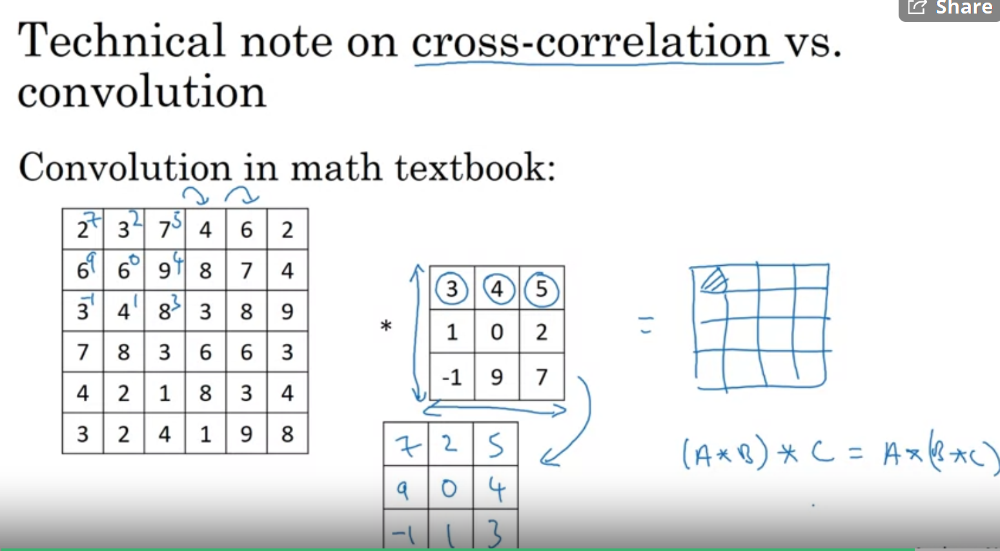

以前对多层卷积一直理解错了：其实每个3×3×3的卷积核只会得到一个2维的4×4，如果训练两个卷积核就会得到4×4×2的输出，以此类推。

多层卷积：有几层要用**channel**不要用**depth**，**depth**容易和神经网络的深度混淆。

最后，卷积后真正的输出是加bias b并且用relu函数的结果

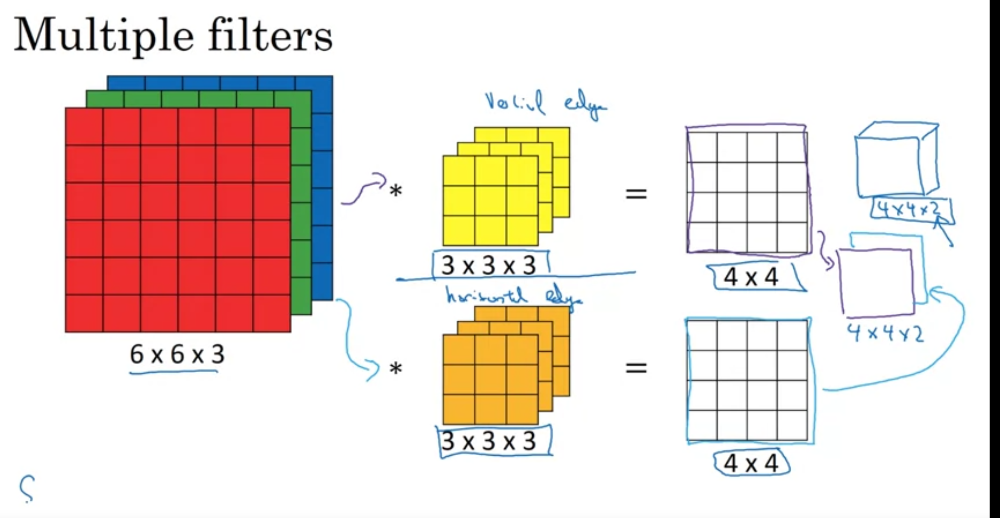


零是黑，白色是255

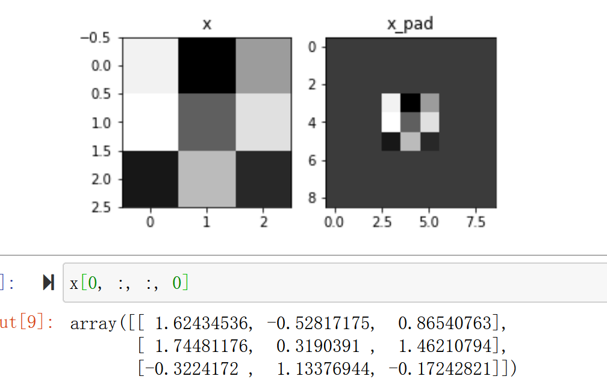


So these is really one property of convolution neural network that **makes it less** **prone to overfitting** . 

- 网络走的越深，w宽度和h高度越窄，channels越多
- 一个或者多个卷积层后面会加一个池化层

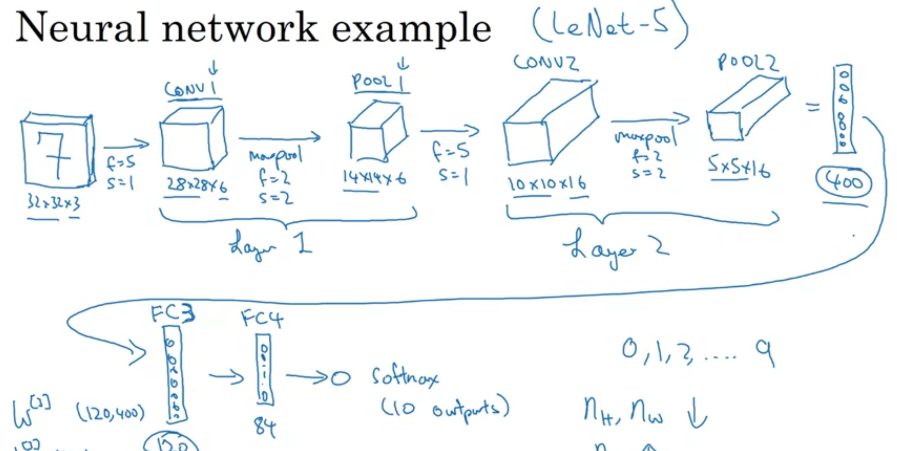

So we'll do that next week, but **before wrapping this week's videos** **just one last thing which is** 结束这周

#### 参数个数

吴老师图里写错了

1. 208 should be (5\*5\*3 + 1) \* 8 = 608  很重要！！！
2. 416 should be (5\*5\*8 + 1) \* 16 = 3216

3. In the FC3, 48001 should be 400\*120 + 120 = 48120, since the bias should have 120 parameters, not 1 很重要！！！

4. Similarly, in the FC4, 10081 should be 120*84 + 84 (not 1) = 10164

(Here, the bias is for the fully connected layer.  In fully connected layers, there will be one bias for each neuron, so the bias become In FC3 there were 120 neurons so 120 biases.)

5. Finally, in the softmax, 841 should be 84*10 + 10 = 850


#### 使用卷积的好处

- parameter sharing 节约参数，每个像素只和周围一圈像素有关
- sparsity of connections 不像全连接，无论物体在图片中的任何位置，都可以用filter探测到

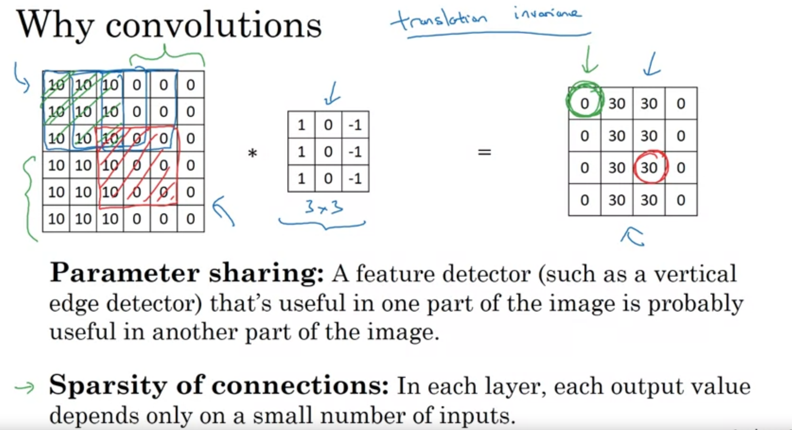

$$n_H = \Bigl\lfloor \frac{n_{H_{prev}} - f + 2 \times pad}{stride} \Bigr\rfloor +1$$
$$n_W = \Bigl\lfloor \frac{n_{W_{prev}} - f + 2 \times pad}{stride} \Bigr\rfloor +1$$
$$n_C = \text{number of filters used in the convolution}$$


**卷积的四维矩阵的含义**

平时一直没有关注过，如果是一个两行三列的矩阵，平时我们会说2×3，但换算成维度第0维是2，第一维是3。

但如果是四维的输入，如下图`A_prev = np.random.randn(2, 5, 7, 4)`。第一维度2代表样本数m，第二维度5代表高度h，第三维度7代表宽度w，第四维度4代表channel数为4。之所以弄混的原因是，平时我们说矩形都说长×宽，但是图片是分高度height和宽度width，但宽度其实是长度。如果一个图片是2*3，则意味着高度h为2，宽度w为3。

```python
np.random.seed(1)
A_prev = np.random.randn(2, 5, 7, 4)
W = np.random.randn(3, 3, 4, 8)
b = np.random.randn(1, 1, 1, 8)
hparameters = {"pad" : 1,
               "stride": 2}

Z, cache_conv = conv_forward(A_prev, W, b, hparameters)
```


 Lucent Technologies was **spun off**. 独立出来

starting to **encroach** significantly into even other fields 侵占(某人的时间);侵犯(某人的权利) ；扰乱(某人的生活等);                                                                                                                                                

And then the fact that the company is not **obsessively compulsive** about IP as some other companies are makes it much easier to collaborate with universities and have arrangements by which a person can have a foot in industry and a foot in academia. 过分的；难以制止的； compulsory强行的

onerous [ˈoʊnərəs]费力的

#### 使用tf.data.Dataset.from_tensor_slices五步加载数据集

[使用tf2做mnist（kaggle）的代码](https://github.com/Rainweic/tensorflow2-mnist)

思路

Step0: 准备要加载的numpy数据
Step1: 使用 tf.data.Dataset.from_tensor_slices() 函数进行加载
Step2: 使用 shuffle() 打乱数据
Step3: 使用 map() 函数进行预处理
Step4: 使用 batch() 函数设置 batch size 值
Step5: 根据需要 使用 repeat() 设置是否循环迭代数据集

##### 代码

```python
import tensorflow as tf
from tensorflow import keras

def load_dataset():
	# Step0 准备数据集, 可以是自己动手丰衣足食, 也可以从 tf.keras.datasets 加载需要的数据集(获取到的是numpy数据) 
	# 这里以 mnist 为例
	(x, y), (x_test, y_test) = keras.datasets.mnist.load_data()
	
	# Step1 使用 tf.data.Dataset.from_tensor_slices 进行加载
	db_train = tf.data.Dataset.from_tensor_slices((x, y)）
	db_test = tf.data.Dataset.from_tensor_slices((x_test, y_test))
	
	# Step2 打乱数据
	db_train.shuffle(1000)
	db_test.shuffle(1000)
	
	# Step3 预处理 (预处理函数在下面)
	db_train.map(preprocess)
	db_test.map(preprocess)

	# Step4 设置 batch size 一次喂入64个数据
	db_train.batch(64)
	db_test.batch(64)

	# Step5 设置迭代次数(迭代2次) test数据集不需要emmm
	db_train.repeat(2)

	return db_train, db_test

def preprocess(labels, images):
	'''
	最简单的预处理函数:
		转numpy为Tensor、分类问题需要处理label为one_hot编码、处理训练数据
	'''
	# 把numpy数据转为Tensor
	labels = tf.cast(labels, dtype=tf.int32)
	# labels 转为one_hot编码
	labels = tf.one_hot(labels, depth=10)
	# 顺手归一化
	images = tf.cast(images, dtype=tf.float32) / 255
	return labels, images

```


Even if you end up not working computer vision yourself, I think you find a lot of the ideas from some of these exampkes, such as ResNet Inception network, many of these ideas are **cross-fertilizing** on **making their way into other disciplines**. 杂交

#### VGG16

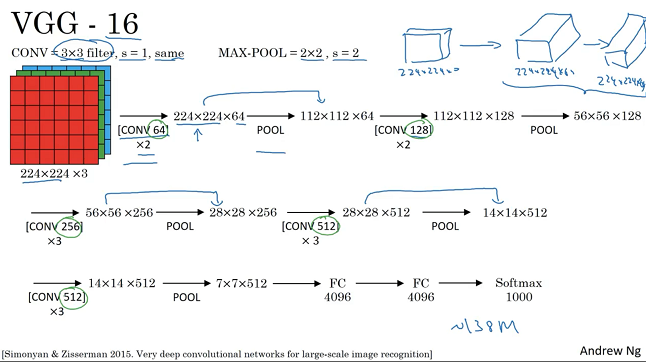

特点：doubling on every stack of conv-layers 越来越小，越来越长

### ResNet

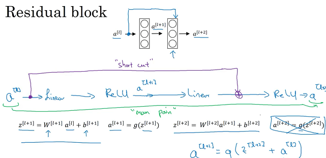

特点：第一个卷积层是正常的，但是会同时连接到第二个卷积的卷积后，ReLu函数前。

The **short cut** / **Residual Connection** / **Skip Connection** is actually added before the ReLu non-linearity.

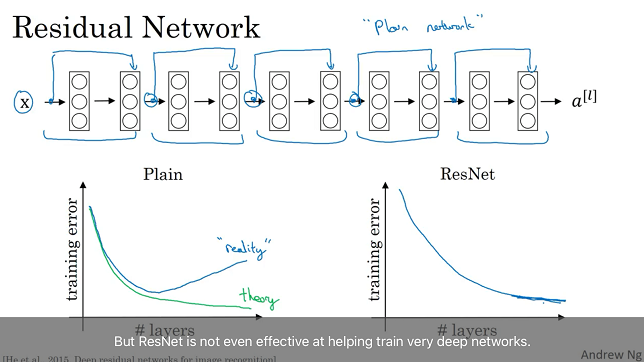

理论上来说，网络越深，训练误差会越少。但实际上，训练误差反而会增加。

But what happens with ResNet is that even as the number of layers gets deeper, you can have the performance of the training error going down.

通过short cut的方式，helps with vanishing and exploding gradient problems and allows you to train much deeper neural networks without really **appreciable** loss in performance, and will plateau at some point. 明显的

#### Inception

特点：

- 1x1卷积，`bottleneck`， 可以帮助节约参数，解决网络层数过多的问题，并且并不影响效果。在两个地方用到了，一个是不同卷积方式拼接后层数过多；一个是在卷积前使用减少参数（相当于承接上一个botttleneck传来的数据）

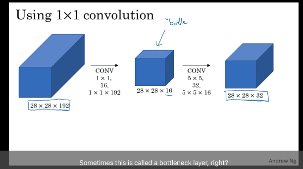

- 可以一次性把所有的卷积和池化放进去，由模型自己选。（会带来层数过多的问题，但已经可以通过1x1卷积解决）需要保证卷积和池化均为'same'，下图的池化池化完仍然是192层，需要1x1卷积调整成32层。

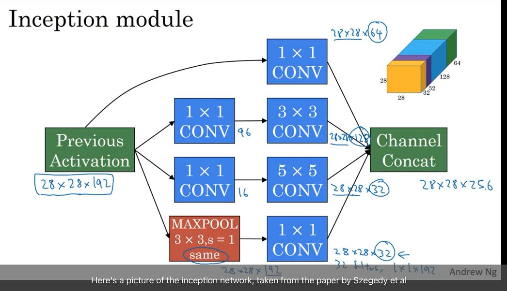

- 在中间部分使用和末尾部分相同的结构输出结果，如下图绿线所示，可以防止过拟合。And this appears to have a regularizing effecr on the inception network and helps prevent this network from overfitting. 
- 让特征更加好 Ensure features computed, even in heading units, even at intermediate layers, that are not too bad for predicting the output class of a Image. 
- 个人感觉有点像dropout，强行让参数学的更好。

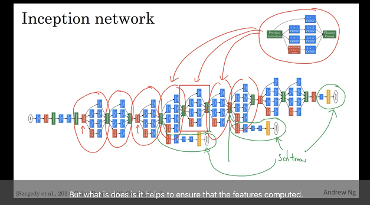

#### MobileNet

- 普通卷积

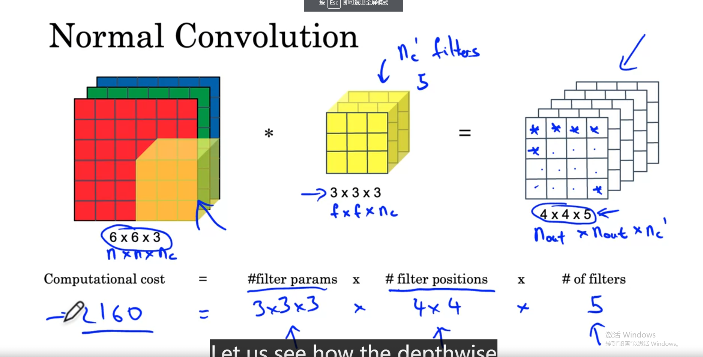

- depthwise卷积


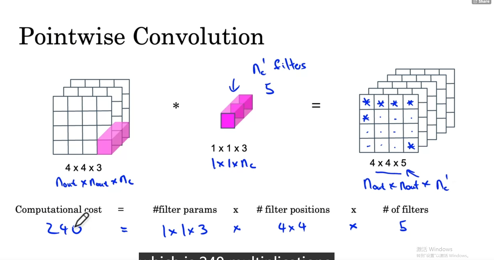

- 参数个数 2160>>432+240
- 按经验来说，输出的channel数一般为512，f为卷积核的大小，因此在实际中一般是1：10的节约

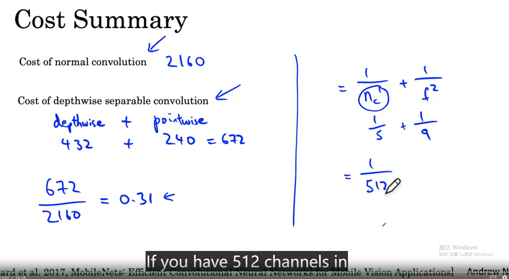


特点：

- depthwise-separable convolutions+pointwise convolution 每个卷积只有一层，去分别卷积输入图的所有层。此时输出层数一定和输出层数相同。如果要调整输出的通道层数，通过pointwise 用n个1x1卷积把三层的结果转换为n层。（这里吴老师的图片没讲清楚）

#### Depthwise Separable Convolution

Depthwise Separable Convolution是将一个完整的卷积运算分解为两步进行，即Depthwise Convolution与Pointwise Convolution。

##### Depthwise Convolution

不同于常规卷积操作，Depthwise Convolution的一个卷积核负责一个通道，一个通道只被一个卷积核卷积。上面所提到的常规卷积每个卷积核是同时操作输入图片的每个通道。
同样是对于一张5×5像素、三通道彩色输入图片（shape为5×5×3），Depthwise Convolution首先经过第一次卷积运算，不同于上面的常规卷积，DW完全是在二维平面内进行。卷积核的数量与上一层的通道数相同（通道和卷积核一一对应）。所以一个三通道的图像经过运算后生成了3个Feature map(如果有same padding则尺寸与输入层相同为5×5)，如下图所示。

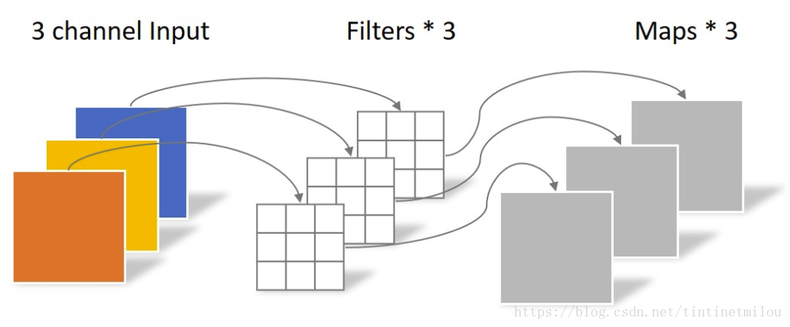

Depthwise Convolution完成后的Feature map数量与输入层的通道数相同，无法扩展Feature map。而且这种运算对输入层的每个通道独立进行卷积运算，没有有效的利用不同通道在相同空间位置上的feature信息。因此需要Pointwise Convolution来将这些Feature map进行组合生成新的Feature map。

##### Pointwise Convolution

Pointwise Convolution的运算与常规卷积运算非常相似，它的卷积核的尺寸为 1×1×M，M为上一层的通道数。所以这里的卷积运算会将上一步的map在深度方向上进行加权组合，生成新的Feature map。有几个卷积核就有几个输出Feature map。如下图所示。


- This turns out to perform well while being much less computationally expensive than earlier algorithms that used a normal convolutional operation.

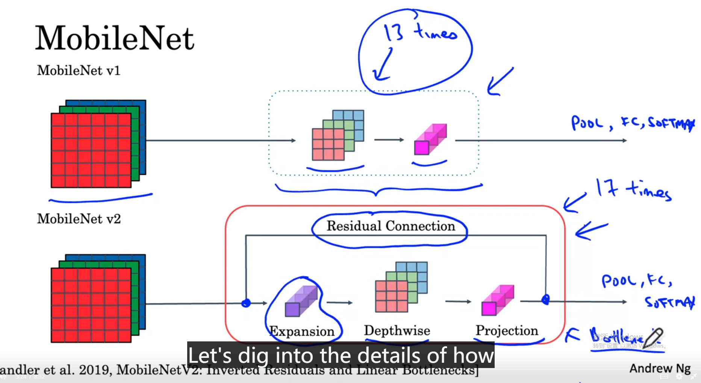

MobileNet v2的结构也叫bottleneck，相对于v1，多了一步用1x1卷积expansion和residual的步骤

在下图，它先用1x1卷积Expansion增维（Inception是用1x1降维），然后对每一层卷积，最后再用Pointwise降维。


I'm using this **blue glow** here to denote maybe high resolution image. 蓝光

#### EfficientNet

help you to choose a good trade-off between r, d, and w.

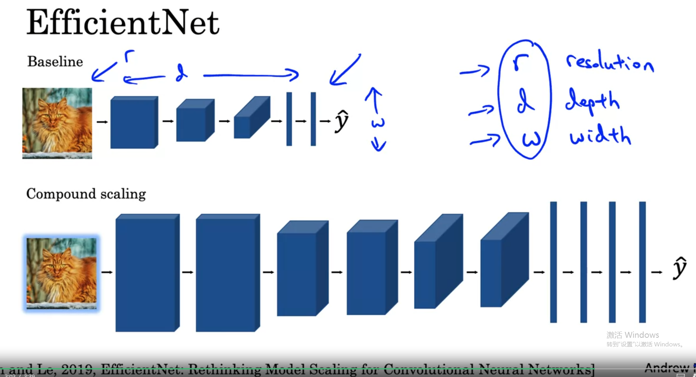

### 数据增强

- color shifting
- PCA color Augmentation

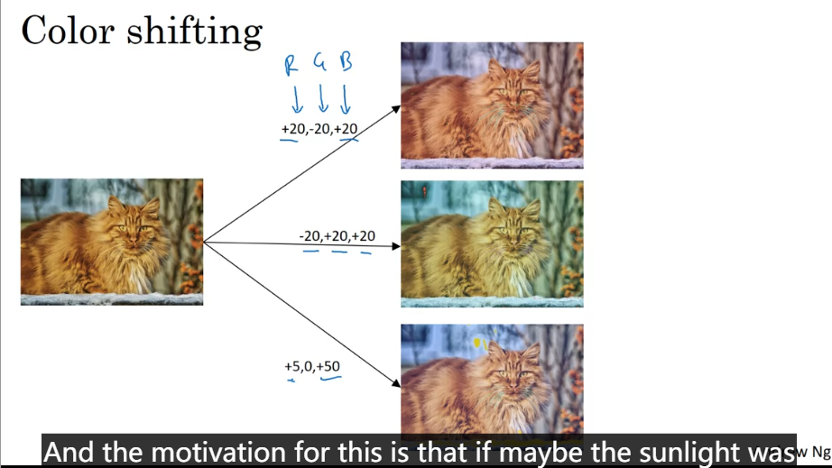

If your image is mainly purple, if it mainly has red and blue **tints**, and very little green, then PCA Color Augmentation will add and subtract a lot to red and blue, but relatively little to  the greens, so kind of keeps the overall color of the **tint** the same. 浅色调

So, if you look across **a broad spectrum of** machine learning problems, you see on average that when you have a lot of data you tend to find people getting away with using simpler algorithms as well as less hand-engineering.

#### 如何赢下竞赛

- Ensambling

- Multi-crop (这个我没见过) 比如说10-crop

  就是说，在测试集的图片上，先对图片mirroring，再分别对两张图片随机裁剪左上角，右上角等大部分区域，进行预测。对预测结果取平均

  10-crop就是对正反两张图的 正、左上右上等四个方向共10图crop

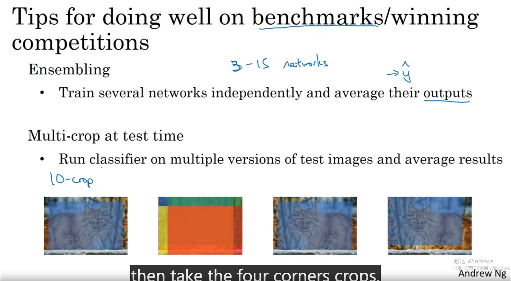

For multi-crop I guess at least you keep just one network around, so it doesn't **suck up** as much memory, but it still slows down your run time quite a bit 讨好

you can use an open source implementation if possible, because the open source implementation might have figured out all the **finicky** details like the learning rate, case scheduler, and other hyper parameters. 难讨好的，难取悦的, 需细心的，需注意细节的

### 图片增强与迁移学习

具体可见W2A2中用MobileNet实现增强与迁移学习的例子，感觉这是实战中最常用的手段了。

#### 用AutoTune设定每次读取文件的个数

You may have encountered `dataset.prefetch` in a previous TensorFlow assignment, as an important extra step in data preprocessing. 

Using `prefetch()` prevents a memory bottleneck that can occur when reading from disk. It sets aside some data and keeps it ready for when it's needed, by creating a source dataset from your input data, applying a transformation to preprocess it, then iterating over the dataset one element at a time. Because the iteration is streaming, the data doesn't need to fit into memory.

You can set the number of elements to prefetch manually, or you can use `tf.data.experimental.AUTOTUNE` to choose the parameters automatically. Autotune prompts `tf.data` to tune that value dynamically at runtime, by tracking the time spent in each operation and feeding those times into an optimization algorithm. The optimization algorithm tries to find the best allocation of its CPU budget across all tunable operations. 

To increase diversity in the training set and help your model learn the data better, it's standard practice to augment the images by transforming them, 

i.e., randomly flipping and rotating them. Keras' Sequential API offers a straightforward method for these kinds of data augmentations, with built-in, customizable preprocessing layers. These layers are saved with the rest of your model and can be re-used later.  Ahh, so convenient! 

As always, you're invited to read the official docs, which you can find for data augmentation [here](https://www.tensorflow.org/tutorials/images/data_augmentation).

#### 多轮训练

If you do not set initial_epoch and you train for 2 epochs, then rerun the fit_generator with epochs=4 it will train for 4 **more** epochs starting from the state preserved at the end of the second epoch (provided you use the built in optimizers). Again the history object state is NOT preserved from the initial training and only contains the data for the last 4 epochs. I noticed this because I plot the validation loss versus epochs.

说白了就是给tensorboard画图用的，

如果继续训练时，设置nitial_epoch为0，epochs为500，tensorboard会在同一张图上重叠显示两段结果；
如果initial_epoch设置为500，epochs应该设置为1000，tensorboard会合并成0-1000代的整段图。

因此只是用于显示，实际上再训练的时候还会接着训练


## Object Detection

### Object Localization


Localization：知道这是一个汽车的图像（已经识别出来），在图中把汽车定位出来

Detection：里面有很多汽车，我都要找出来

So, in particular, you can have the neural network output four more numbers, and I'm going to call them bx, by, bh, and bw. And these four numbers parameterized the bounding box of the detected object


y的输出形式，第一个 $p_c$表示是否有我们想分类的1、2、3三种类别。之后的四个角是他的四个坐标。最后$c_1$ $c_2$ $c_3$ 是最终的分类类别，这三个数只能取其一为1。

**很重要**：对于损失函数来说，$c_1$ $c_2$ $c_3$ 应当使用log likelihood+Softmax，因为它们是多分类。b1b2b3b4应当用L2损失，因为它们相当于回归。$p_c$是二分类，应当用Logistic Regression Loss。


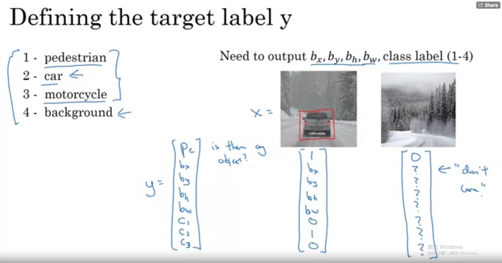

#### 业务启示

它的损失函数就是L2损失，但是如果$p_c$为0，也就是图中没有物体要检测，那么损失只看$\hat{y_1}$和$y_1$就行了，也就是有没有分对图中是否有物体要检测这一点。

这一点在业务中我曾经问过马凯：结构话模型需不需要加负样本进去，例如：tff模板，有些图片是第二页，只含有少量的文字，没有要提取的字段。马凯说不用加，因为有前置分类模型让它进入不了tff这一块。但我现在觉得，如果有负样本，并不会让模型学到任何东西，因为没有损失发生，因此这个样本就没有反向传播这一流程。就像这里一样。

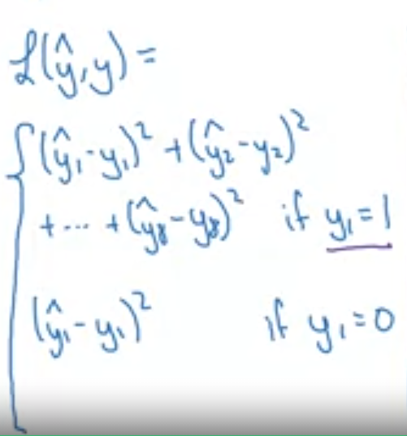

### Landmark Detection

landmark 地标


**for the sake of argument**, let's say 64 points or 64 landmarks on the face. 为了论证

define the **jaw line**by selecting a number of landmarks and generating a label training sets that contains all of these landmarks, you can then have the neural network to tell you where are all the key positions or the key landmarks on a face 下颌线

用AR augmented reality时，ins抖音，如何探测你的脸并把妆画上去

Being able to detect these landmarks on the face, there's also a key building block for the computer graphics effects that warp the face or drawing various special effects like putting a crown or a hat on the person. 

where someone will have had to go through and laboriously annotate all of these landmarks.

**laboriously [ləˈbɔriəsli] 辛苦地**

One last example, if you are interested in people pose detection, you could also define a few key positions like the midpoint of the chest, the left shoulder, left **elbow**, the **wrist**, and so on, and just have a neural network to annotate key positions in the person's pose as well and by having a neural network output,

elbow 肘部 wrist [rɪst] 手腕

### Sliding Window Detection

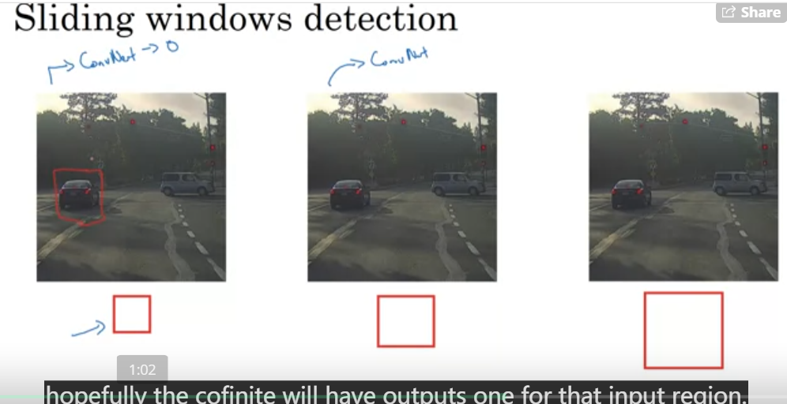

方法：用一个小块去扫描全局，捕获汽车。逐渐换更大的window再去扫描

input into this cofinite a small rectangular region. 

 if you use a very coarse stride, then that will reduce the number of windows you need to pass through the convnet, but that coarser **granularity** may hurt performance. Whereas high computational cost.

在以前，都是人工构造的特征，因此sliding window的方式很好用，因为计算快，都是linear function

now running a single classification task is much more expensive and sliding windows this way **is infeasibily slow**.

###  A convolutional implementation of sliding windows object detection

用卷积可以大量减少参数，

之前的和卷积形式的实现效果是相同的，如下：

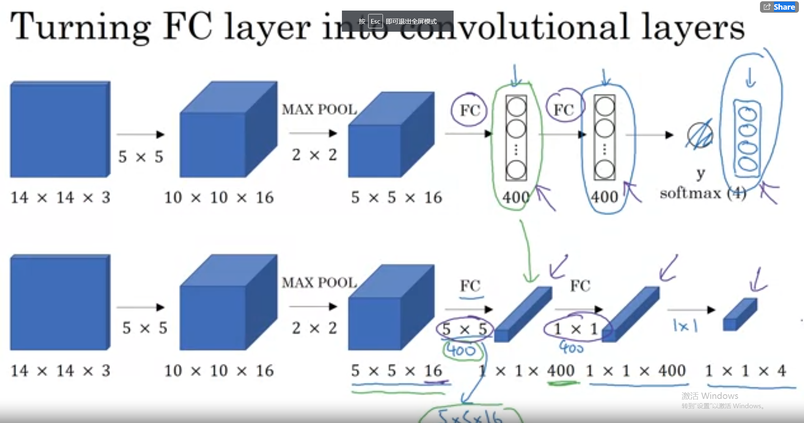

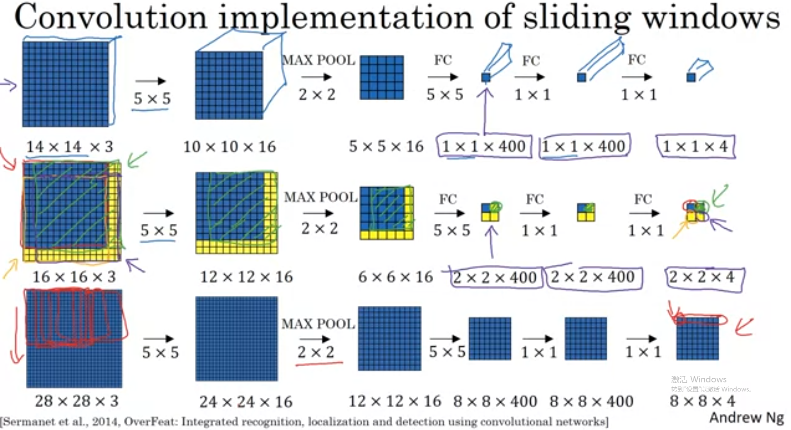

可以快速知道哪一块里有汽车，而不是一步一步重复计算，一个神经网络就搞定。

缺点：不够准确

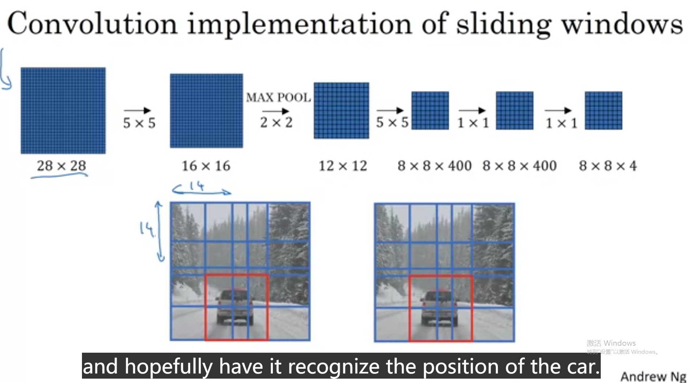

### YOLO

划分成3x3=9个区域（实际中会划分成19*19=361个小块），以物体的中心点在哪个区域来判断物体属于哪个区域，采取最开始的方法定义y。因此输出为3x3x8。

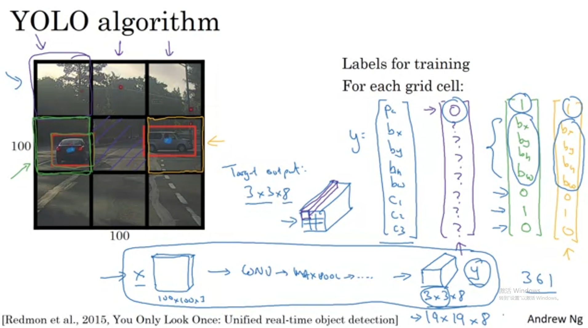

我觉得训练还是很好理解的，标注好左上角坐标和height,width（如果h,w出现横跨小块就会大于1），划分好小块就可以训练，这就好解释了。即使一个物体横跨多个区域，也只分进一个区域。

这里可能会有一个误解：并不是分别对这9个区域做9次卷积，而是只做一次卷积得到3x3x8的输出，所有卷积都共享参数。看起来并没有告诉卷积核：哪些初始区域对应了最终3x3=9个的输出，但是模型会去学对应关系。

预测时，不需要考虑一个物体横跨多个区域，也只分进一个区域这一特点，因为已经不是训练了。


##### 个人评价

- YOLO吸取了Object Localization的优点，保留了一样的输出方式。

- 没有用传统的landmark的方法，当时课程项目还是用haar cascade特征做的。
- 采用了conv sliding window类似的策略，可以共享参数，一次卷积。但conv sliding window对不同大小的输入图片会得到不同的输出，且无法处理物体横跨的情况，只能定死地看每一个固定小块内是否有汽车，且没法适应物体的大小程度。
- 但是YOLO可以处理跨小块的物体，且用回归的方式返回坐标。并且每个物体只会被分进一个小块内，所以物体都一定能被检测到，且横跨的问题也解决了。
- 但有人肯定会问：我为什么要3x3的小块呢？直接对汽车的四个坐标做回归不就完事了？根本原因是因为你不知道图中有几个汽车，因此划分成小块后，只需要对每个小块做一次分类就行了。
- 肯定有人又要问：这不就是削弱版的sliding window吗？首先，sliding window只负责判断该小块内有没有汽车，sliding window当然可以用图片单分类的方式做8维输出回归，但重复学了很多仅仅平移就学到的知识，没有必要。其次，对于跨块的样本，YOLO中直接用大于1的w和h就解决了这个问题。sliding window当然可以学YOLO一样很多步stride走完整张图片，但是相对于YOLO，它其实做了很多没必要的步骤，就好像打比赛的时候用Ensabmble模型，但是真正迎来效果大提升的永远是创新的方法。
- 说白了，就是sliding window的简版，在原来只有分类的版本上加了回归，最亮眼的是设计的xywh坐标的回归，并保证不会重复看，减少了大量的计算负担。

### 注意点：

there are some more complicated parameterizations involving sigmoid functions to make sure this is between 0 and 1. 

左上角的坐标的输出会加sigmoid激活函数，w和h会用exp激活函数保证是非负的

In the meantime, if you want, you can take a look at YOLO paper reference at the bottom of these past couple slides I use. Although, just one warning, if you take a look at these papers which is the YOLO paper is one of the harder papers to read. I remember, when I was reading this paper for the first time, I had a really hard time figuring out what was going on. And I wound up asking a couple of my friends, very good researchers to help me figure it out, and even they had a hard time understanding some of the details of the paper. So, if you look at the paper, it's okay if you have a hard time figuring it out. 

I wish it was more uncommon, but it's not that uncommon, sadly, for even senior researchers, that review research papers and have a hard time figuring out the details. And have to look at open source code, or contact the authors, or something else to figure out the details of these outcomes. But don't let me stop you from taking a look at the paper yourself though if you wish, but this is one of the harder ones. 

### Intersection Over Union

IoU=Intersection/Union

Correct if IoU>0.5

If you want to be more **stringent**, you can judge an answer as correct, only if the IoU is greater than equal to 0.6 or some other number. [ˈstrɪndʒənt] 严格的

### Non-max Supression

解决对一个物体重复画框多次的问题

non-max means that you're going to output your maximal probabilities classifications but suppress the **close-by** ones that are non-maximal. 离xx很近

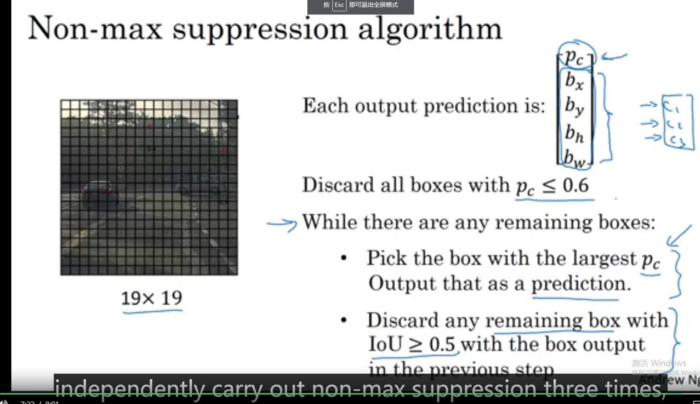

如果多分类就分别做n次

#### 业务启示

当时看小韩老师的输出，有一个`4.`还有一个`4. xxxxxx` 于是我很好奇，问小韩老师：为什么会这样呢？这不应该啊，有两个框输出了相同的一部分，一个框的内容在另一个框以内？小韩老师说：确实有这种情况，并让我算一下IoU卡阈值。我当时觉得太麻烦就没算。

现在想来，应该是小韩老师做的non-max supression里，对IoU卡的阈值为0.5，但这个例子可能只有0.4，因此没卡掉。当时考虑到可能是有字重叠的情况（例如印章），要加强识别的能力，因此就像目标检测一样这样做。

然而，在ocr里还有一种情况，如果正常文本的话，不会有重叠的，因此可以直接卡IoU为一个非常低的值。

### Anchor Boxes

解决一个在一个小块内探测多个目标的问题，用到了anchor box的思想：

- 预先定义好两种形状的anchor box
- y的输出维度由3x3x8变成3x3x16，上下两个区域分别对应两种anchor box的输出
- 预测时：探测在这两种anchor box形状下的输出
- 训练时：对每一个物体，定好中心，用两个anchor box分别去套，哪一个IoU大，就归进哪个anchor box


#### 缺点

1. 如果一个小块中由三个物体，但只用了两个anchor box，那么就没有办法检测第三个。但实际中我们划分成19x19的小块，已经很少会出现一个小块三个物体的情况了
2. 如果两个物体在同一个grid cell里，且拥有一样的anchor box（例如两个人），也就是有一样的形状，那么也没法处理

better results that anchor boxes gives you is it allows your learning algorithm to specialize better. 

this allows your learning algorithm to specialize so that some of the outputs can specialize in detecting white, fat objects like cars, and some of the output units can specialize in detecting tall, skinny objects like pedestrians. 

在之后的YOLO论文中，用kmeans分类出两种你所需要的anchor box形状

And then to use that to select a set of anchor boxes that this most **stereotypically representative** of the maybe multiple 典型代表性          

In the next video, let's take everything we've seen and **tie it back together into** the YOLO algorithm.   向回串联

### YOLO算法合集

#### 训练预测


#### non-max supression

- 先处理anchor box的信息，对每一个grid cell输出的两个anchor box，过滤到低概率的anchor box （注意，在这一步中，可能有的grid cell的左上角xy不在该grid cell内）
- 然后就不管anchor box和grid cell了，直接对每一个分出来的类别进行non-max supression，不断找到一个类别中最高概率的输出，去掉所有IoU>0.5的框，再往下找次高的输出，再去掉。。。


### Region Proposal R-CNN

Regions with CNNs, 两步走

1. propose regions
2. classifiers

#### segmentation algorithm

 you find maybe 2000 blobs and place bounding boxes around about 2000 blobs and run your classifier on just those 2000 blobs, and this can be a much smaller number of positions on which to run your convnet classifier, then if you have to run it at every single position throughout the image


- 缺点是R-CNN很慢
- 虽然是用CNN再去探测一遍，但是R-CNN仍然会返回坐标，就像之前的输出一样

#### 演变


2013年的R-CNN是用神经网络一个一个移动，再去卷积的；

2015年的Fast R-CNN是用sliding window的方式，用卷积代替手工移动，有共享参数的优势，因此更快。

2016年的Faster R-CNN是何凯明大神提出的，用卷积神经网络去propose region，解决了原有的segmentation algorithm计算慢的问题（但还是比不上YOLO快）

uses a convolutional neural network instead of one of the more traditional segmentation algorithms to propose a blob on those regions, and that wound up running quite a bit faster than the fast R-CNN algorithm. 

#### 业务启示

我们当时用的ocr分定位识别两步，实际上用的mrcnn作为定位模型，且没有要求定位模型提供输出，只要求它提供bounding box，再用识别模型去识别它，因为带transformer的识别模型效果一定比直接识别文字的效果来得更好，但是牺牲了很多效率，增加了很多computational cost。

#### 个人评价

R-CNN是人类的正常思维方式，yolo简直是神想出来的。你去思考object detection算法的时候，你肯定希望分这两步走：1.先判断这里是不是会有一个东西 2.这是个什么东西。但经常人看到一样东西就会直接反应出：哦，这是一个杯子，再看到它在桌子上（定位它的坐标）。而不是先观察到桌子上有一个东西，再看出它是一个杯子

R-CNN慢的原因是：它仍然需要两步走，先propose region看自由分割出的区域内是否有物体，再对region识别。Yolo跳过了propose region的一步，直接一次卷积后输出所有结果。

But that's my personal opinion and not necessary the opinion of the whole computer vision research committee. So feel free to **take that with a grain of salt**, 

take sth. with a grain of salt 这个习语的字面意思是“和一撮盐一起吃下去”，为什么要与盐一起吃呢？

据说这个习语要追溯到罗马时代，罗马将军庞培曾发现一种解毒剂，必须和着一小把盐才服得下去。解毒剂难咽，加了盐也许好咽些，于是这句习语用于描述对一些不靠谱的，值得怀疑的东西，得“和着盐”才能勉强接受。

现在，对某件事情或某人说的话有所保留，将信将疑，持怀疑态度，就可以说 take it with a grain of salt.

### Semantic Segmentation with U-Net


segment out in the image exactly which pixels correspond to certain parts of the patient's **anatomy**. 解剖出的人体


### Transpose Convolution


如果重叠，就对两个区域内的值相加


#### 网络结构


skip connection既可以学到 lower resolution, but high level spatial, high level contextual information（也就是原本从U-Net中一步一步传过来的信息），也可以学到high resolution, the low level, more detailed texture like information

What the skip connection does is it allows the neural network to take this very high resolution, low level feature information where it could capture for every pixel position, how much fairy stuff is there in this pixel? 


往下走时，channel数不断增加，但是h,w是变小的，每一步池化都对应了红色箭头。

注意点：白色箭头是skip connection，还记得残差连接吗？就是把原有的输入**加**到现有的channel后面，组成一个更深的网络。但这里是**拼接**（图中深蓝和浅蓝），再用卷积调整channel数，一个类似Inception的方法。

最终输出是$n_{classes}$层，再通过argmax函数画出我们实际看到的segmentation map

一些需要理解的细节：是怎么argmax生成segmentation map的，为什么不直接用残差而是要像Inception一样拼接？残差是用Add()函数，拼接用什么函数？


## NLP

referring to the **genre** of music you want to generate or maybe the first few notes of the piece of music you want [ˈʒɑːn] 音乐的类型

Jazz **improvisation** with LSTM 即兴创作

